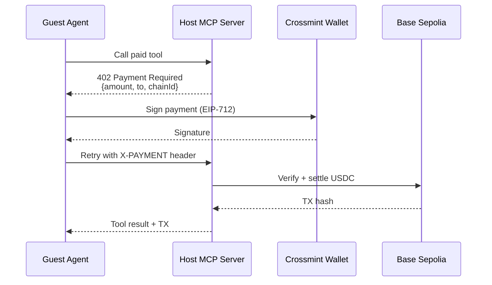
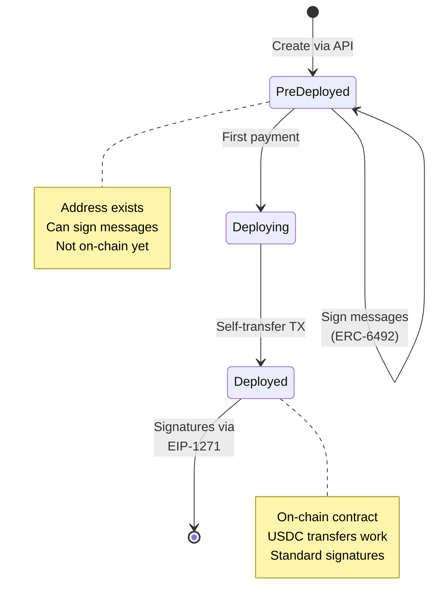

## Overview

Events Concierge is a production-ready reference implementation showing how AI agents can autonomously pay for MCP (Model Context Protocol) tool calls using smart wallets and the x402 payment protocol.

**What makes this different:** Real on-chain USDC payments on Base, autonomous agent-to-agent transactions, and production-grade multi-tenant architecture—no mocks, no simulations, no toy examples.

## Why This Matters

Traditional approaches to monetizing MCP servers require:
- Manual payment flows that break agent autonomy
- Private key management (security nightmare)
- Custom payment infrastructure
- User intervention for every transaction

**This demo shows a better way:**

```
User: "RSVP to event abc-123"
  ↓
Guest Agent: Detects paid tool, checks price ($0.05)
  ↓
Guest Agent: Signs USDC payment autonomously
  ↓
Host Agent: Verifies signature, settles on Base
  ↓
Guest Agent: "You're registered! TX: 0xabc...def"
```

**Zero user intervention** after initial confirmation. The agent handles everything: signature generation, payment submission, transaction verification, error recovery.

## Quick Start

```bash
# 1. Install dependencies
npm install

# 2. Get API keys
# - Crossmint Console: https://www.crossmint.com/console
# - OpenAI Platform: https://platform.openai.com/api-keys

# 3. Configure environment
cp .dev.vars.example .dev.vars
# Edit .dev.vars:
#   CROSSMINT_API_KEY=sk_...
#   OPENAI_API_KEY=sk-...

# 4. Run locally
npm run dev
```

Visit `http://localhost:5173` to see the chat interface.

## Your First Autonomous Payment

### 1. Connect the Agents

- Click "Connect to Events" in the chat
- Guest agent establishes MCP connection to Host

### 2. Create an Event (as Host)

- Go to `http://localhost:5173/?view=my-mcp`
- Sign in with email OTP
- Create an event with a price (e.g., $0.05)

### 3. Get Testnet USDC

- Copy the Guest wallet address from chat
- Visit [Circle Faucet](https://faucet.circle.com/)
- Select "Base Sepolia" and paste address
- Mint 1 USDC

### 4. Watch Autonomous Payment

- Say: `rsvp to event <event-id>`
- Guest agent detects 402 response
- Confirms payment with user
- Signs and submits USDC transfer
- Retries MCP call with payment proof
- Displays TX hash and confirmation

<Note>
**No MetaMask. No private keys. No manual signing.** Just HTTP and smart contracts.
</Note>

## Core Technologies

This demo combines four production technologies:

### 1. Paid MCP Tools (x402 Protocol)

MCP tools are functions that agents can call. The x402 protocol adds payment requirements:

```typescript
// Define a paid tool
this.server.paidTool(
  "rsvpToEvent",           // Tool name
  "RSVP to a paid event",  // Description
  0.05,                    // Price in USD
  { eventId: z.string() }, // Input schema
  {},                      // Output schema
  async ({ eventId }) => {
    // Your business logic
    const event = await getEvent(eventId);
    await recordRsvp(eventId, guestWallet);
    return { success: true, event };
  }
);
```

**What happens when called:**

```
1. Guest Agent: "Call rsvpToEvent(eventId='abc-123')"
   ↓
2. Host Agent: HTTP 402 Payment Required
   {
     "payment": {
       "amount": "50000",  // 0.05 USDC (6 decimals)
       "currency": "USDC",
       "to": "0x123...",
       "chainId": 84532
     }
   }
   ↓
3. Guest Agent: Signs payment with smart wallet
   ↓
4. Guest Agent: Retries with header: X-PAYMENT: <signature>
   ↓
5. Host Agent: Verifies signature → Settles on-chain → Executes tool
   ↓
6. Guest Agent: Receives result + TX hash
```

<Tip>
The `402` status code (reserved since HTTP/1.1 in 1997) finally has a use case. Payment requirements are just HTTP headers.
</Tip>

### 2. x402: HTTP-Native Payments

x402 makes the `402 Payment Required` status code work for real transactions:

```typescript
// Auto-handle 402 responses
const server = new McpServer({ ... })
  .withX402Client({
    wallet: crossmintWallet,
    onPaymentRequired: async (requirement, retryFn) => {
      // Confirm with user
      const approved = await askUser(`Pay ${requirement.amount} USD?`);
      if (!approved) return;

      // Sign payment (EIP-712 typed data)
      const signature = await wallet.signPayment(requirement);

      // Retry request with proof
      return retryFn(signature);
    }
  });
```

**Payment Flow:**



<Note>
Payments are just HTTP retries with cryptographic proofs. No WebSockets, no polling, no custom protocols.
</Note>

### 3. Cloudflare Durable Objects: Stateful Agents

Normal serverless functions are stateless—great for APIs, terrible for agents that need to maintain conversation state, MCP connections, and payment history.

**Durable Objects are:**
- **Single-threaded** - No race conditions, guaranteed serial execution
- **Stateful** - In-memory state persists across requests
- **Globally unique** - Only ONE instance per ID worldwide
- **Auto-scaling** - Created on-demand, hibernate when idle

```typescript
export class Host extends DurableObject {
  private wallet: CrossmintWallet;
  private server: McpServer;

  constructor(ctx: DurableObjectState, env: Env) {
    super(ctx, env);
    // Initialize once, persists across requests
    this.wallet = await createHostWallet(env);
    this.server = new McpServer({ ... });
  }

  async fetch(request: Request) {
    // All requests to /mcp/users/abc-123 hit THIS instance
    return this.server.handleRequest(request);
  }
}
```

**Per-user isolation:**

```
User A → /mcp/users/hash-a → Host DO (name: "hash-a")
                               ├─ wallet: 0xAAA...
                               ├─ events: [...]
                               └─ revenue: $12.50

User B → /mcp/users/hash-b → Host DO (name: "hash-b")
                               ├─ wallet: 0xBBB...
                               ├─ events: [...]
                               └─ revenue: $8.00
```

**Why not regular Workers?**

| Need | Regular Worker | Durable Object |
|------|---------------|----------------|
| MCP connection state | ❌ Lost between requests | ✅ Persists in memory |
| WebSocket support | ❌ No state | ✅ Built-in |
| Coordination | ❌ Race conditions | ✅ Single-threaded |
| Per-user isolation | ❌ Shared instance | ✅ Unique per ID |

<Note>
Durable Objects are "mini-servers per user" that never have concurrency bugs. Perfect for stateful agent protocols like MCP.
</Note>

### 4. Crossmint Smart Wallets: No Private Keys

Traditional wallets require managing private keys—terrible UX, security nightmare, non-starter for autonomous agents.

**Crossmint smart wallets:**
- Controlled via API (server-side) or email OTP (client-side)
- ERC-4337 compliant smart contract accounts
- Work **before** on-chain deployment (ERC-6492 signatures)
- Auto-deploy on first transaction
- Validate signatures via EIP-1271

```typescript
// Create wallet from API key
const wallet = CrossmintWalletService.from({
  apiKey: env.CROSSMINT_API_KEY,
  chain: "base-sepolia"
});

// Sign payment (works even if wallet not deployed yet!)
const signature = await wallet.signTypedData({
  domain: { chainId: 84532, ... },
  types: { Payment: [...] },
  primaryType: "Payment",
  message: { amount: "50000", to: "0x123...", ... }
});
```

**Smart Wallet Lifecycle:**



**ERC-6492 vs EIP-1271:**

| Stage | Standard | How It Works |
|-------|----------|-------------|
| **Pre-deployed** | ERC-6492 | Signature includes deployment bytecode. Verifiers simulate deployment, check signature against simulated contract. |
| **Deployed** | EIP-1271 | Standard smart contract signature validation. Contract's `isValidSignature()` verifies. |

<Note>
Smart wallets can sign transactions before they exist on-chain. No deployment costs until first real transaction.
</Note>

## Architecture Overview

```
┌─────────────────────────────────────────────────────────────┐
│  Browser (React UI)                                         │
│  • Chat interface for user commands                         │
│  • WebSocket connection to Guest Agent                      │
│  • Payment confirmation modal                               │
└─────────────────────┬───────────────────────────────────────┘
                      │ WebSocket
                      ↓
┌─────────────────────────────────────────────────────────────┐
│  Cloudflare Worker (Gateway)                                │
│  • Route: /agent → Guest Agent DO                           │
│  • Route: /mcp/users/{id} → Host Agent DO                   │
│  • Route: /api/* → KV operations                            │
└─────────────────────┬──────────────┬────────────────────────┘
                      │              │
         ┌────────────┘              └────────────┐
         ↓                                        ↓
┌──────────────────────┐              ┌──────────────────────┐
│  Guest Agent DO      │◄─────MCP────►│  Host Agent DO       │
│  (name: "default")   │   Protocol   │  (name: userId hash) │
│                      │              │                      │
│  • WebSocket server  │              │  • MCP server        │
│  • Crossmint wallet  │              │  • Paid tools        │
│  • Payment signer    │              │  • Event storage     │
│  • Shared instance   │              │  • Per-user instance │
└──────────────────────┘              └─────────┬────────────┘
         │                                      │
         │                                      ↓
         │                            ┌──────────────────────┐
         │                            │  Cloudflare KV       │
         │                            │  • users:{email}     │
         │                            │  • {hash}:events:*   │
         │                            │  • {hash}:revenue    │
         │                            └──────────────────────┘
         │
         └──────────────┬─────────────────────────────────────┐
                        ↓                                     ↓
              ┌───────────────────┐              ┌──────────────────────┐
              │  Crossmint API    │              │  Base Sepolia        │
              │  • Wallet mgmt    │              │  • USDC settlement   │
              │  • Signature API  │              │  • TX verification   │
              └───────────────────┘              └──────────────────────┘
```

## Code Walkthrough

### File Structure

```
events-concierge/
├── src/
│   ├── agents/
│   │   ├── host.ts          # MCP server with paid tools (300 LOC)
│   │   └── guest.ts         # MCP client with auto-payment (200 LOC)
│   │
│   ├── shared/
│   │   └── eventService.ts  # KV operations for events (150 LOC)
│   │
│   ├── utils/
│   │   ├── cors.ts          # CORS headers for MCP
│   │   └── hashing.ts       # User ID → URL-safe hash
│   │
│   ├── x402Adapter.ts       # Crossmint → viem wallet adapter (100 LOC)
│   ├── server.ts            # Cloudflare Worker entry point (200 LOC)
│   ├── client.tsx           # React UI (optional for demo)
│   └── constants.ts         # Chain config, addresses
│
├── wrangler.toml            # Durable Object bindings
└── package.json
```

### Host Agent: Exposing Paid Tools

**Location:** `src/agents/host.ts`

```typescript
export class Host extends DurableObject {
  private wallet: CrossmintWallet;
  private server: McpServer;
  private userId: string;

  constructor(ctx: DurableObjectState, env: Env) {
    super(ctx, env);
    this.userId = ctx.id.toString();

    // Create wallet from API key (server-side, no user interaction)
    this.wallet = await CrossmintWalletService.from({
      apiKey: env.CROSSMINT_API_KEY,
      chain: "base-sepolia"
    });

    // Initialize MCP server with x402 support
    this.server = new McpServer({
      name: `Event Host for ${this.userId}`,
      version: "1.0.0"
    })
      .withX402({
        wallet: this.wallet,
        facilitator: X402_FACILITATOR_URL,
        usdcAddress: USDC_ADDRESS,
        chainId: BASE_SEPOLIA_CHAIN_ID,
      });

    this.registerTools();
  }

  private registerTools() {
    // FREE tool: List events
    this.server.tool(
      "listEvents",
      "List all events created by this host",
      {},
      {},
      async () => {
        const events = await listEvents(this.env.KV, this.userId);
        return { events };
      }
    );

    // PAID tool: RSVP to event ($0.05)
    this.server.paidTool(
      "rsvpToEvent",
      "RSVP to an event (requires payment)",
      0.05,  // Price in USD
      { eventId: z.string() },
      {},
      async ({ eventId }, paymentTx: string) => {
        // Only executed if payment verified!
        const event = await getEvent(this.env.KV, this.userId, eventId);
        if (!event) throw new Error("Event not found");

        // Record RSVP
        await recordRsvp(this.env.KV, this.userId, eventId, {
          guestWallet: paymentTx.from,
          paidAmount: "50000",
          txHash: paymentTx.hash,
          timestamp: Date.now()
        });

        return {
          success: true,
          event,
          transactionHash: paymentTx.hash,
          message: `RSVP confirmed! Paid ${event.price} USDC.`
        };
      }
    );
  }
}
```

<Note>
**Key insights:**
1. `paidTool()` vs `tool()` - only difference is the price parameter
2. Payment verification happens BEFORE your handler runs
3. Transaction hash passed as second parameter to handler
4. KV keys scoped by userId for isolation
</Note>

### Guest Agent: Auto-Paying Client

**Location:** `src/agents/guest.ts`

```typescript
export class Guest extends DurableObject {
  private wallet: CrossmintWallet;
  private mcpClient: McpClient | null = null;

  async connectToHost(hostMcpUrl: string) {
    this.mcpClient = new McpClient({
      url: hostMcpUrl,
      transport: "http"
    })
      .withX402Client({
        wallet: this.wallet,
        onPaymentRequired: async (requirement, retryFn) => {
          // 1. Notify user via WebSocket
          this.websocket?.send(JSON.stringify({
            type: "payment_required",
            amount: requirement.amount,
            currency: requirement.currency,
            tool: requirement.tool,
          }));

          // 2. Wait for user confirmation
          const approved = await this.waitForConfirmation();
          if (!approved) throw new Error("Payment declined");

          // 3. Sign payment (Crossmint handles EIP-712)
          const signature = await this.wallet.signPayment(requirement);

          // 4. Retry MCP call with signature
          const result = await retryFn(signature);

          // 5. Notify user of success + TX hash
          this.websocket?.send(JSON.stringify({
            type: "payment_confirmed",
            txHash: result.transactionHash,
            explorerUrl: `https://sepolia.basescan.org/tx/${result.transactionHash}`
          }));

          return result;
        }
      });

    await this.mcpClient.connect();
  }

  async callTool(toolName: string, args: any) {
    // This will automatically handle 402 responses!
    return this.mcpClient.callTool(toolName, args);
  }
}
```

<Note>
**Key insights:**
1. `.withX402Client()` adds automatic 402 handling
2. `onPaymentRequired` callback gets retry function
3. Confirmation flow is customizable (auto-approve, user prompt, etc.)
4. Signature and TX hash sent to browser for transparency
</Note>

### x402 Adapter: Crossmint → viem Bridge

**Location:** `src/x402Adapter.ts`

The x402 SDK expects a `viem` account. Crossmint provides a wallet API. This adapter bridges them:

```typescript
import { type Account } from "viem";
import { CrossmintWallet } from "@crossmint/client-sdk";

export function createViemAccountFromCrossmint(
  wallet: CrossmintWallet
): Account {
  return {
    address: wallet.address as `0x${string}`,
    type: "local",

    async signTransaction(tx: TransactionRequest) {
      const signature = await wallet.signTransaction(tx);
      return signature as `0x${string}`;
    },

    async signTypedData(typedData: TypedDataDefinition) {
      const signature = await wallet.signTypedData(typedData);
      return signature as `0x${string}`;
    },

    async signMessage({ message }: { message: string | Uint8Array }) {
      const signature = await wallet.signMessage(message);
      return signature as `0x${string}`;
    }
  };
}
```

<Tip>
This adapter pattern works for ANY wallet provider (Privy, Magic, Dynamic, etc.) by implementing viem's `Account` interface.
</Tip>

## Testing the Payment Flow

### 1. Check Wallet Balances

```bash
# Guest wallet (needs USDC to pay)
cast balance <GUEST_WALLET_ADDRESS> --rpc-url https://sepolia.base.org

# Host wallet (receives USDC)
cast call 0x036CbD53842c5426634e7929541eC2318f3dCF7e \
  "balanceOf(address)(uint256)" \
  <HOST_WALLET_ADDRESS> \
  --rpc-url https://sepolia.base.org
```

### 2. Test RSVP Payment Flow

In browser console (`http://localhost:5173`):

```javascript
ws = new WebSocket("ws://localhost:5173/agent");
ws.onmessage = (e) => console.log("Received:", JSON.parse(e.data));

// Connect to host
ws.send(JSON.stringify({
  type: "connect",
  hostUrl: "http://localhost:5173/mcp/users/<userId>"
}));

// List events (free tool)
ws.send(JSON.stringify({
  type: "call_tool",
  tool: "listEvents",
  args: {}
}));

// RSVP to event (paid tool, triggers 402 flow)
ws.send(JSON.stringify({
  type: "call_tool",
  tool: "rsvpToEvent",
  args: { eventId: "<event-id>" }
}));
```

### 3. Verify Transaction On-Chain

```bash
# Get TX details
cast tx <TX_HASH> --rpc-url https://sepolia.base.org

# Check USDC transfer event
cast receipt <TX_HASH> --rpc-url https://sepolia.base.org | grep Transfer
```

**Expected output:**
```
Transfer(from: 0x<guest>, to: 0x<host>, value: 50000)
```

## Deployment to Production

### 1. Create Cloudflare Account

```bash
npx wrangler login
```

### 2. Create KV Namespace

```bash
# Production KV
npx wrangler kv:namespace create "KV"

# Preview KV (for staging)
npx wrangler kv:namespace create "KV" --preview
```

Copy the namespace IDs into `wrangler.toml`:

```toml
[[kv_namespaces]]
binding = "KV"
id = "abc123..."              # Production ID
preview_id = "def456..."      # Preview ID
```

### 3. Set Secrets

```bash
npx wrangler secret put OPENAI_API_KEY
# Paste your key when prompted

npx wrangler secret put CROSSMINT_API_KEY
# Paste your key when prompted
```

### 4. Deploy

```bash
npm run deploy
# or
npx wrangler deploy
```

Your app is now live at `https://events-concierge.<your-subdomain>.workers.dev`

### 5. Switch to Mainnet

Update `src/constants.ts`:

```typescript
// Before (testnet)
export const CHAIN_ID = 84532;
export const CHAIN_NAME = "base-sepolia";
export const USDC_ADDRESS = "0x036CbD53842c5426634e7929541eC2318f3dCF7e";

// After (mainnet)
export const CHAIN_ID = 8453;
export const CHAIN_NAME = "base";
export const USDC_ADDRESS = "0x833589fCD6eDb6E08f4c7C32D4f71b54bdA02913";
```

Redeploy with `npm run deploy`.

### Production Checklist

- [ ] Use mainnet chain config
- [ ] Real USDC contract address
- [ ] Production Crossmint API key (not development)
- [ ] Set proper CORS origins (not `*`)
- [ ] Add rate limiting (Cloudflare WAF)
- [ ] Monitor with Cloudflare Analytics
- [ ] Set up alerts for failed payments

## Resources

### Protocols & Standards

- [x402 Protocol](https://x402.org) - HTTP 402 payment specification
- [Model Context Protocol](https://modelcontextprotocol.io) - MCP spec (Anthropic/OpenAI)
- [ERC-6492](https://eips.ethereum.org/EIPS/eip-6492) - Pre-deployed contract signatures
- [EIP-1271](https://eips.ethereum.org/EIPS/eip-1271) - Smart contract signature validation
- [EIP-712](https://eips.ethereum.org/EIPS/eip-712) - Typed structured data signing

### Services & Tools

- [Crossmint Wallets](https://docs.crossmint.com/wallets) - Smart wallet API docs
- [Cloudflare Durable Objects](https://developers.cloudflare.com/durable-objects/) - DO documentation
- [Cloudflare Agents SDK](https://developers.cloudflare.com/agents/) - Agent framework
- [Base Network](https://base.org) - Ethereum L2 by Coinbase
- [Circle USDC](https://www.circle.com/en/usdc) - Stablecoin documentation

### Blockchain Tools

- [Base Sepolia Explorer](https://sepolia.basescan.org/) - Testnet block explorer
- [Base Mainnet Explorer](https://basescan.org/) - Mainnet block explorer
- [Circle Faucet](https://faucet.circle.com/) - Free testnet USDC
- [Foundry](https://book.getfoundry.sh/) - `cast` CLI for blockchain interaction
