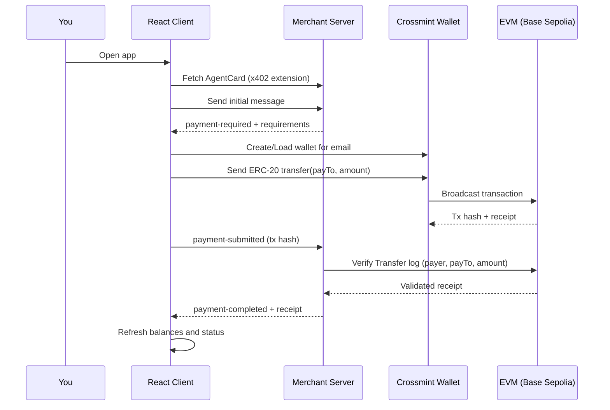

## Overview

This demo shows a complete Agent-to-Agent (A2A) payment flow using the x402 payments extension and the Crossmint Wallets SDK in a single React web app plus a tiny merchant server.

<iframe
  width="560"
  height="315"
  src="https://www.youtube.com/embed/kEWolUayE_Q"
  title="Crossmint Wallets with A2A x402 Protocol"
  frameBorder="0"
  allow="accelerometer; autoplay; clipboard-write; encrypted-media; gyroscope; picture-in-picture"
  allowFullScreen
></iframe>

## What It Does

### Server (Merchant)

- Advertises the x402 extension via its AgentCard
- Replies to the first client message with payment requirements (`x402.payment.required`)
- Verifies payment using the `direct-transfer` scheme by reading ERC-20 `Transfer` logs on-chain
- Publishes a receipt with the transaction hash when everything matches

### Client (React App)

- Presents a simple UI for the A2A flow
- Uses Crossmint Wallets to create/load the payer wallet
- Sends an ERC-20 `transfer` from that wallet
- Submits the tx hash back over x402
- Live-updates balances and status once the server confirms

## Sequence Flow



## Quick Start

### Prerequisites

- Node.js 18+ and npm
- A `.env` file with your Crossmint credentials

### 1. Setup Environment

```bash
# Copy template and fill in values
cp env.example .env
```

Required environment variables:

| Variable | Description | Default |
|----------|-------------|--------|
| `RPC_URL` | RPC URL for the merchant server to connect to | - |
| `MERCHANT_ADDRESS` | The merchant payee address | Required |
| `ASSET_ADDRESS` | USDC contract address | `0x036CbD53842c5426634e7929541eC2318f3dCF7e` (Base Sepolia) |
| `X402_NETWORK` | Network identifier | `base-sepolia` |

### 2. Install Dependencies

```bash
npm install
```

### 3. Start Both Services

```bash
# Terminal 1: merchant server (port 10000)
npm run server

# Terminal 2: React client (port 3000)
npm run dev
```

### 4. Open the Demo

- **React App**: http://localhost:3000
- **Server API**: http://localhost:10000
- **AgentCard**: http://localhost:10000/.well-known/agent-card.json

## Key Points

<Note>
Crossmint is the payer in this demo. You do not need a user private key; the Crossmint wallet service signs and sends the transfer, and the server verifies it on-chain. The merchant config only requires `MERCHANT_ADDRESS`.
</Note>

## Getting Testnet Tokens

Base Sepolia USDC: Use the [Circle Faucet](https://faucet.circle.com/) and send to your Crossmint wallet address.

## Scripts

```bash
npm run server    # Start merchant server (port 10000)
npm run dev       # Start React client (port 3000)
```

## Behind the Scenes

### Discovery and Activation

The client opts in to the payments extension and loads the merchant's AgentCard using the `X-A2A-Extensions` header. See `A2AClient.fromCardUrl` and `fetchWithExtension` in `app/page.tsx`.

### Request and Requirements

The client sends an initial message; the merchant replies with a Task whose message `metadata` includes:
- `x402.payment.status: "payment-required"`
- `x402.payment.required`

See `handlePayment()` in `app/page.tsx`.

### Wallet Setup (Payer)

A Crossmint wallet is created/loaded for `email:{userEmail}` on the requested chain. See:
- `createCrossmint`
- `CrossmintWallets.from`
- `wallets.createWallet` in `app/page.tsx`

### Direct Transfer

The client executes ERC-20 `transfer(payTo, amount)` from the Crossmint wallet. See `evmWallet.sendTransaction` usage in `handlePayment()`.

### Payment Submission

The tx hash and details are sent back with:
- `x402.payment.status: "payment-submitted"`
- `x402.payment.payload`

### Server Verification

The server:
1. Checks the receipt
2. Verifies the `Transfer` log for exact payer, payTo, and amount
3. Publishes `payment-completed` with a receipt

See `server.js`.

### Receipts and Balances

The client:
- Reads `x402.payment.receipts`
- Refreshes balances via RPC + ERC-20 calls

See `checkBalances()` in `app/page.tsx`.

## Payment Schemes

This demo uses the `direct-transfer` payment scheme:

1. Client performs a direct ERC-20 transfer
2. Server verifies the transaction on-chain
3. No signature verification needed (transaction itself is proof)
4. Simpler than EIP-3009 but requires gas fees from payer

## References

- [A2A JavaScript SDK](https://github.com/a2aproject/a2a-js)
- [Crossmint Wallets SDK](https://www.npmjs.com/package/@crossmint/wallets-sdk)
- [x402 Protocol](https://x402.org)
- [EIP-3009: Transfer With Authorization](https://eips.ethereum.org/EIPS/eip-3009)
