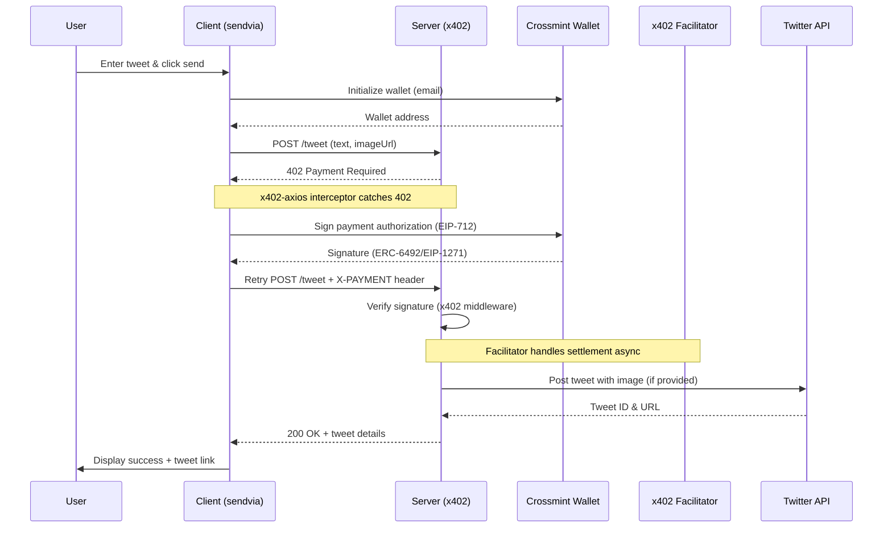

## Overview

The Send Tweet Agent is a unified Next.js application that posts tweets to X/Twitter for payment via the x402 protocol. The app uses Next.js middleware for payment validation, API routes for tweet posting, and a React frontend with Crossmint smart wallets for payment authorization.

## Architecture

This is a **full-stack Next.js application** with:

- **Frontend**: React app with Crossmint wallet integration (`/`)
- **Middleware**: x402 payment validation using `x402-next`
- **API Routes**:
  - `/api/tweet` - Posts tweets (protected by x402 payment)
  - `/api/health` - Health check endpoint
  - `/api/wallet/init` - Creates wallets for users
- **Twitter Integration**: Server-side Twitter API v2 integration

## Prerequisites

- Node.js 18.0.0+
- Twitter Developer Account with API v2 access (Elevated tier, Read+Write permissions)
- Crossmint API key (`sk_staging_*` or `sk_production_*`)
- Base Sepolia testnet (default) or Base mainnet

### User Requirements

Users only need:
- An email address to create an account
- USDC in their wallet to send tweets ($1 per tweet)

## Installation

```bash
# Navigate to the Next.js app directory
cd sendvia

# Install dependencies
npm install
```

## Configuration

Create `.env.local` in the `sendvia` directory:

```bash
cd sendvia
cp env.example .env.local
```

### Required Variables

```bash
# Merchant wallet address for receiving payments
MERCHANT_ADDRESS=0x742d35Cc6634C0532925a3b844Bc9e7595f0bEb

# Twitter API credentials
TWITTER_CONSUMER_KEY=ABCxyz123...
TWITTER_CONSUMER_SECRET=ABCxyz123...
TWITTER_ACCESS_TOKEN=123-ABCxyz...
TWITTER_ACCESS_TOKEN_SECRET=ABCxyz123...

# x402 Configuration
X402_NETWORK=base-sepolia    # or 'base' for mainnet
PRICE_USDC=1                  # price per tweet in USDC

# Crossmint API Keys
CROSSMINT_API_KEY=sk_staging_...                    # Backend operations
NEXT_PUBLIC_CROSSMINT_API_KEY=sk_staging_...        # Client-side signing (same key)
```

### Twitter API Setup

1. Create app at https://developer.x.com/en/portal/dashboard
2. Set app permissions to "Read and Write" (not "Read only")
3. Apply for "Elevated" access (required for v2 API tweet posting)
4. Generate API keys after setting permissions
5. Verify Twitter account has phone number attached
6. Copy all 4 credentials to `sendvia/.env.local`

## Running the Application

### Development Mode

```bash
npm run dev
```

App runs on http://localhost:3000

### Production Build

```bash
npm run build
npm run start
```

## Usage

1. Open http://localhost:3000
2. Enter your email address to create an account
3. Click "Create Account" - creates a secure payment wallet automatically
4. Enter your tweet text (max 280 characters)
5. Optional: Add an image URL
6. Click "Send Tweet · $1"
7. Payment is processed automatically and tweet is posted
8. View your tweet on Twitter or check the payment transaction on-chain

<Tip>
**Developer Mode**: Click the "Dev Mode" button in the top-right to see technical logs and debugging information.
</Tip>

## API Reference

### POST /api/wallet/init

Creates a new wallet for a user (requires backend Crossmint API key).

**Request:**
```json
{
  "email": "user@example.com"
}
```

**Response (200):**
```json
{
  "address": "0x1234567890abcdef...",
  "email": "user@example.com",
  "network": "base-sepolia"
}
```

**Errors:**
- `400` - Invalid or missing email
- `500` - Server configuration error or wallet creation failed

### GET /api/health

Health check endpoint.

**Response (200):**
```json
{
  "status": "healthy",
  "timestamp": "2025-10-08T12:34:56.789Z",
  "network": "base-sepolia",
  "merchantAddress": "0x742d35Cc6634C0532925a3b844Bc9e7595f0bEb",
  "twitterConfigured": true,
  "endpoints": {
    "tweet": "$1"
  }
}
```

### POST /api/tweet

Posts tweet with payment verification (protected by x402 middleware).

**Authentication:** x402 payment protocol (EIP-712 signature)

**Price:** $1 USDC (configurable via `PRICE_USDC`)

**Headers:**
```
Accept: application/vnd.x402+json
Content-Type: application/json
X-PAYMENT: <signature> (added automatically by x402-axios on retry)
```

**Request:**
```json
{
  "text": "Hello world",
  "imageUrl": "https://example.com/image.jpg"
}
```

**Response (402) - First attempt without payment:**
```json
{
  "error": "Payment Required",
  "paymentDetails": {
    "amount": "1000000",
    "token": "USDC",
    "network": "base-sepolia",
    "merchant": "0x742d35Cc6634C0532925a3b844Bc9e7595f0bEb"
  }
}
```

**Response (200) - After payment verification:**
```json
{
  "success": true,
  "message": "Tweet sent successfully! Tweet ID: 1234567890123456789",
  "tweetId": "1234567890123456789",
  "tweetUrl": "https://twitter.com/user/status/1234567890123456789",
  "data": {
    "id": "1234567890123456789",
    "text": "Hello world"
  }
}
```

**Errors:**
- `400` - Missing or invalid tweet text / Tweet exceeds 280 characters
- `401` - Twitter API authentication failed
- `402` - Payment required or verification failed
- `403` - Twitter API permission denied
- `429` - Twitter API rate limit exceeded
- `500` - Internal server error or Twitter API error

## Payment Flow



## Technical Architecture

### Next.js Middleware (`sendvia/middleware.ts`)

- x402-next payment middleware for Next.js
- Validates EIP-712 signatures before allowing API access
- Configured for `/api/tweet` endpoint
- External facilitator handles on-chain settlement (https://x402.org/facilitator)

### API Routes (`sendvia/app/api/`)

- `/api/wallet/init` - Creates wallet using backend Crossmint API key
- `/api/tweet` - Twitter API v2 integration, posts tweets after payment verification
- `/api/health` - Health check and configuration status
- Server-side Twitter client with image download/upload support

### Frontend (`sendvia/app/page.tsx`)

- Minimal, tweet-first user interface
- Email-only account creation (no API key required from users)
- x402-axios interceptor for automatic payment handling
- localStorage persistence for account data
- Developer mode toggle for technical logs
- User-friendly error messages and status updates
- Responsive design with success animations

### x402 Adapter (`sendvia/app/x402Adapter.ts`)

- Converts Crossmint wallet to x402-compatible signer
- Handles ERC-6492 signatures (pre-deployed wallets)
- Handles EIP-1271 signatures (deployed wallets)
- Normalizes signature formats for verification

## File Structure

```
send-tweet/
├── package.json             # Root package (runs sendvia scripts)
├── server.js                # Legacy A2A server (not used in main flow)
├── sendvia/                 # Next.js full-stack application
│   ├── middleware.ts        # x402-next payment middleware
│   ├── env.example          # Environment variables template
│   ├── .env.local           # Configuration (create from env.example)
│   ├── app/
│   │   ├── page.tsx         # Minimal tweet-first UI
│   │   ├── layout.tsx       # App layout and metadata
│   │   ├── x402Adapter.ts   # Crossmint to x402 signer adapter
│   │   ├── walletUtils.ts   # Wallet deployment utilities
│   │   ├── globals.css      # Global styles
│   │   └── api/
│   │       ├── wallet/init/ # Wallet creation endpoint
│   │       ├── tweet/       # Tweet posting endpoint
│   │       └── health/      # Health check endpoint
│   ├── package.json         # Application dependencies
│   └── tsconfig.json        # TypeScript config
└── README.md                # Documentation
```

## Troubleshooting

### Error: `MERCHANT_ADDRESS is required`

```bash
# Set merchant address in sendvia/.env.local
cd sendvia
echo "MERCHANT_ADDRESS=0x742d35Cc6634C0532925a3b844Bc9e7595f0bEb" >> .env.local
```

### Error: Twitter API 403 Permission Denied

- Verify app has "Read and Write" permissions
- Regenerate access tokens after changing permissions
- Confirm account has "Elevated" access (not Basic)
- Ensure Twitter account has verified phone number

### Error: Twitter API 401 Authentication Failed

- Verify all 4 credentials in `sendvia/.env.local` are correct
- Check for extra spaces, quotes, or newlines in values
- Regenerate tokens if credentials are old

### Error: Payment verification failed

- Check `X402_NETWORK` matches between client and server (default: base-sepolia)
- Verify `MERCHANT_ADDRESS` is valid Ethereum address
- Confirm Crossmint wallet initialized successfully
- Check browser console for x402 signer errors

### Error: Signature timeout with deployed wallets

<Warning>
**Known Issue**: API key signer + deployed wallets experience timeouts

**Workaround**: Use pre-deployed wallets (skip "Deploy Wallet" button). Pre-deployed wallets use ERC-6492 signatures which work reliably.
</Warning>

## Networks

### Base Sepolia (Default Testnet)

- Network ID: 84532
- RPC: https://sepolia.base.org
- Block explorer: https://sepolia.basescan.org
- Get testnet USDC: [Circle Faucet](https://faucet.circle.com/)

### Base Mainnet

- Network ID: 8453
- RPC: https://mainnet.base.org
- Block explorer: https://basescan.org
- Set `X402_NETWORK=base` in `.env.local`

## Production Deployment

1. Set production environment variables:
   - `X402_NETWORK=base`
   - Use production Crossmint API key (`sk_production_*`)
   - Set production `MERCHANT_ADDRESS`

2. Build and deploy:

```bash
cd sendvia
npm run build
npm run start
```

3. Configure reverse proxy (nginx/caddy) for HTTPS
4. Monitor logs for errors
5. Test with small amounts before production use

## Dependencies

- next@^15.5.3 - Full-stack framework
- react@^19.1.1 - Frontend
- x402-next@^0.6.0 - Next.js payment middleware
- x402-axios@^0.6.6 - Client-side payment interceptor
- twitter-api-v2@^1.27.0 - Twitter API client
- @crossmint/wallets-sdk@0.14.0 - Smart wallet integration
- viem@^2.38.0 - Ethereum utilities
