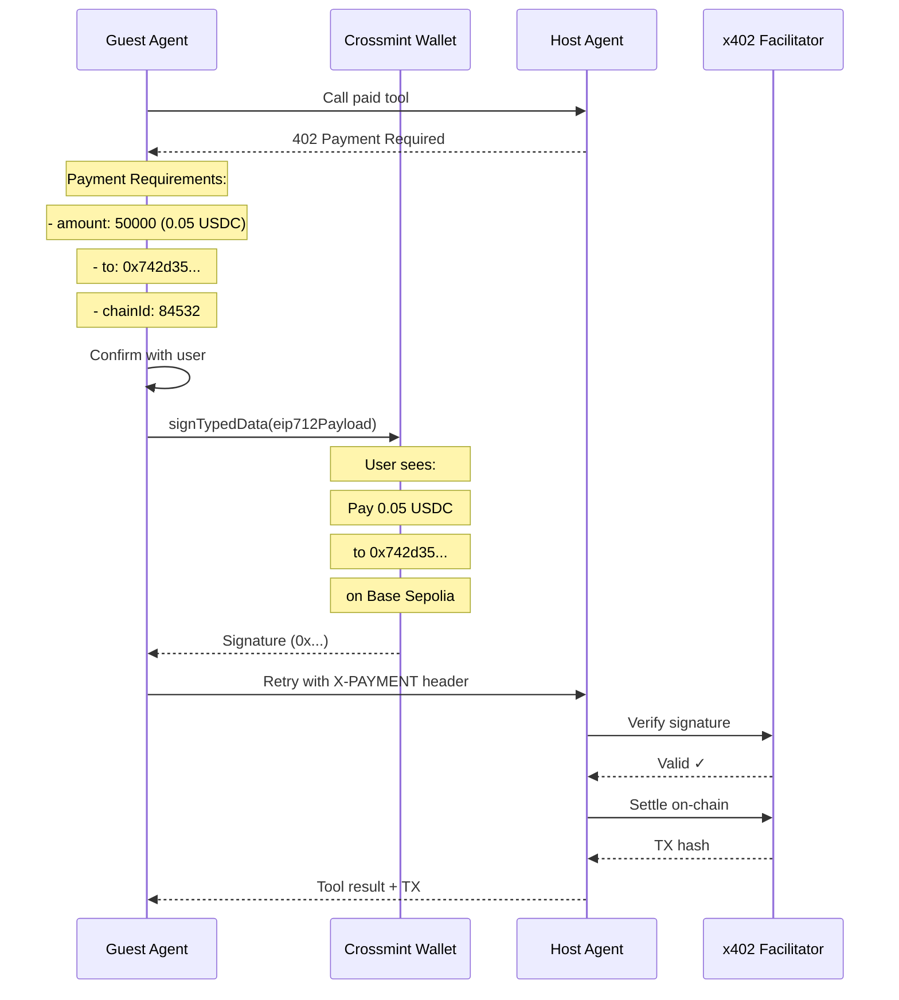

## Overview

EIP-712 (Ethereum Improvement Proposal 712) provides a standard for signing typed structured data. In Crossmint Agentic Finance, EIP-712 signatures enable **human-readable payment confirmations** where users can verify exactly what they're signing before authorizing a payment.

Unlike raw message signing (which shows cryptic hex strings), EIP-712 presents structured data in a readable format, improving security and user trust.

## Why EIP-712 for Payments?

<CardGroup cols={2}>
  <Card title="Human Readable" icon="eye">
    Users see clear payment details: amount, recipient, currency, and chain ID
  </Card>
  <Card title="Type Safety" icon="shield-check">
    Structured schemas prevent malformed payment data
  </Card>
  <Card title="Replay Protection" icon="clock-rotate-left">
    Domain separators and nonces prevent signature reuse
  </Card>
  <Card title="Wallet Compatible" icon="wallet">
    Supported by MetaMask, WalletConnect, and Crossmint wallets
  </Card>
</CardGroup>

## EIP-712 Signature Structure

An EIP-712 signature consists of four components:

```typescript
const eip712Payload = {
  // Domain separator - prevents cross-chain/cross-contract replay
  domain: {
    name: "x402 Payment",
    version: "1",
    chainId: 84532,  // Base Sepolia
    verifyingContract: "0x036CbD53842c5426634e7929541eC2318f3dCF7e"  // USDC contract
  },

  // Type definitions for the message
  types: {
    Payment: [
      { name: "amount", type: "uint256" },
      { name: "currency", type: "address" },
      { name: "to", type: "address" },
      { name: "nonce", type: "uint256" },
    ]
  },

  // Primary type being signed
  primaryType: "Payment",

  // The actual payment data
  message: {
    amount: "50000",  // 0.05 USDC (6 decimals)
    currency: "0x036CbD53842c5426634e7929541eC2318f3dCF7e",  // USDC on Base Sepolia
    to: "0x742d35Cc6634C0532925a3b844Bc9e7595f0bEb",  // Recipient (host wallet)
    nonce: 1709856000000  // Unix timestamp for uniqueness
  }
};
```

### Domain Separator

The domain prevents signature replay attacks across:
- **Different chains**: `chainId` ensures signatures are chain-specific
- **Different protocols**: `name` and `version` identify the protocol
- **Different contracts**: `verifyingContract` ties signature to a specific contract

### Type Definitions

Defines the schema for the payment message:
- `amount` (uint256): Payment amount in smallest unit (e.g., 50000 = 0.05 USDC)
- `currency` (address): Token contract address
- `to` (address): Recipient wallet address
- `nonce` (uint256): Unique value to prevent replay attacks

## Signing with Crossmint Wallets

The x402 adapter bridges Crossmint wallets to the viem Account interface expected by x402:

```typescript x402Adapter.ts
import { Wallet, EVMWallet } from "@crossmint/wallets-sdk";
import type { Hex } from "viem";

export function createX402Signer(wallet: Wallet<any>) {
  const evm = EVMWallet.from(wallet);

  return {
    address: evm.address as `0x${string}`,
    type: "local",
    source: "custom",

    // EIP-712 signing method
    signTypedData: async (params: any) => {
      const { domain, message, primaryType, types } = params;

      console.log("🔐 Signing EIP-712 payment:");
      console.log("  Payer:", evm.address);
      console.log("  Recipient:", message.to);
      console.log("  Amount:", message.amount);
      console.log("  Network:", domain.chainId);

      // Sign with Crossmint wallet
      const sig = await evm.signTypedData({
        domain,
        message,
        primaryType,
        types,
        chain: evm.chain
      });

      return processSignature(sig.signature);
    }
  };
}
```

**Key points:**
- Crossmint wallets support both **ERC-6492** (pre-deployed) and **EIP-1271** (deployed) signatures
- The adapter logs payment details for transparency
- Signature processing handles different formats (see [ERC-6492 Validation](/api/erc-6492-validation))

## Payment Signature Flow



## Example: Guest Agent Signing

From `src/agents/guest.ts:279-285`:

```typescript
// Create x402-compatible signer from Crossmint wallet
const x402Signer = createX402Signer(this.wallet);

// Wrap MCP client with x402 payment support
this.x402Client = withX402Client(this.mcp.mcpConnections[id].client, {
  network: "base-sepolia",
  account: x402Signer  // Will call signTypedData when payment required
});
```

When a paid tool returns 402, the x402 client automatically:
1. Extracts payment requirements from the 402 response
2. Constructs the EIP-712 payload
3. Calls `x402Signer.signTypedData(payload)`
4. Sends signature to the facilitator for verification

## Signature Format Output

After signing, signatures are processed based on wallet deployment status:

### Pre-Deployed Wallets (ERC-6492)

```typescript
// Signature ends with ERC-6492 magic bytes
const signature = "0x...6492649264926492649264926492649264926492649264926492649264926492";

if (isERC6492Signature(signature)) {
  console.log("✅ ERC-6492 signature detected - keeping for facilitator");
  return signature;  // Keep full wrapped signature
}
```

**ERC-6492 signatures include:**
- The actual signature bytes
- Wallet factory address
- Deployment bytecode
- Constructor arguments
- Magic suffix: `0x6492...6492` (32 bytes)

See [ERC-6492 Validation](/api/erc-6492-validation) for details.

### Deployed Wallets (EIP-1271)

```typescript
// Standard 65-byte ECDSA signature for deployed contracts
if (signature.length === 132) {  // 65 bytes * 2 + "0x"
  console.log("✅ Standard ECDSA signature");
  return signature;
}
```

**EIP-1271 signatures** are verified by calling the smart contract's `isValidSignature()` function.

## Security Considerations

<AccordionGroup>
  <Accordion title="Nonce Usage">
    Use unique nonces (timestamps or UUIDs) to prevent replay attacks:

    ```typescript
    message: {
      amount: "50000",
      currency: USDC_ADDRESS,
      to: hostWallet,
      nonce: Date.now()  // Unique per payment
    }
    ```

    **Never reuse nonces** - each payment must have a unique identifier.
  </Accordion>

  <Accordion title="Domain Separation">
    Always verify the domain matches your application:

    ```typescript
    // Verifier checks domain before accepting signature
    if (domain.chainId !== 84532) {
      throw new Error("Wrong chain - expected Base Sepolia");
    }
    if (domain.name !== "x402 Payment") {
      throw new Error("Wrong protocol");
    }
    ```
  </Accordion>

  <Accordion title="Amount Validation">
    Verify payment amounts match tool requirements:

    ```typescript
    // Host checks signed amount matches tool price
    const toolPrice = 0.05 * 1_000_000;  // 50000 (6 decimals)
    if (BigInt(signedMessage.amount) < BigInt(toolPrice)) {
      throw new Error("Insufficient payment");
    }
    ```
  </Accordion>
</AccordionGroup>

## Implementation Checklist

<Steps>
  <Step title="Create x402 Signer">
    Wrap your Crossmint wallet with `createX402Signer()` to provide EIP-712 signing capability.
  </Step>

  <Step title="Define Payment Schema">
    Use the standard x402 Payment type with amount, currency, to, and nonce fields.
  </Step>

  <Step title="Handle User Confirmation">
    Show payment details to the user before calling `signTypedData()`.
  </Step>

  <Step title="Process Signatures">
    Handle both ERC-6492 (pre-deployed) and standard ECDSA signatures.
  </Step>

  <Step title="Submit to Facilitator">
    Send the signature in the `X-PAYMENT` header when retrying the tool call.
  </Step>
</Steps>

## Related Topics

<CardGroup cols={2}>
  <Card title="ERC-6492 Validation" icon="shield" href="/api/erc-6492-validation">
    Pre-deployment signature verification
  </Card>
  <Card title="x402 Facilitator" icon="server" href="/api/facilitator">
    Payment settlement and verification
  </Card>
</CardGroup>

## References

- [EIP-712 Specification](https://eips.ethereum.org/EIPS/eip-712)
- [x402 Protocol Documentation](https://x402.org)
- Source: `events-concierge/src/x402Adapter.ts:30-67`
