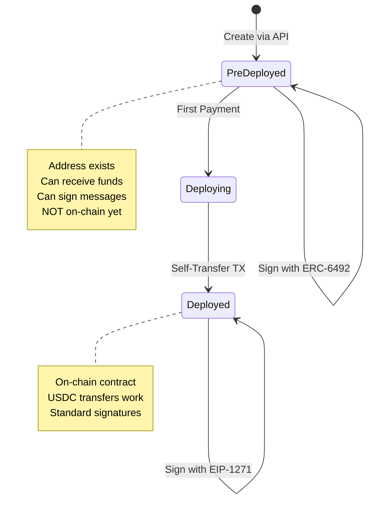
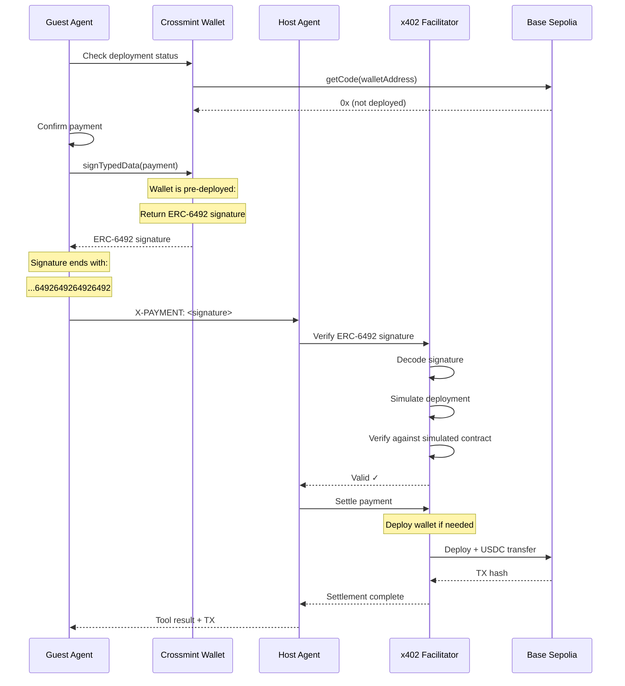

## Overview

ERC-6492 enables **signature verification for smart contract wallets that haven't been deployed yet**. This is critical for Crossmint Agentic Finance because:

1. **Wallet creation is free** - Users get an address immediately via API
2. **No deployment costs upfront** - Wallets deploy only when first transacting
3. **Signatures work pre-deployment** - ERC-6492 wraps signatures with deployment data

Without ERC-6492, users would need to deploy their wallet (pay gas fees) before making their first payment. With ERC-6492, they can sign payments immediately.

## How ERC-6492 Works

### Standard Wallet Lifecycle



### Signature Format Comparison

| Wallet State | Signature Format | Verification Method | Signature Length |
|--------------|------------------|---------------------|------------------|
| **Pre-Deployed** | ERC-6492 wrapped | Simulate deployment, verify signature | Variable (>132 chars) |
| **Deployed** | Standard ECDSA or EIP-1271 | Call `isValidSignature()` on contract | 132 chars (65 bytes) |

## ERC-6492 Signature Structure

An ERC-6492 signature wraps the standard signature with deployment information:

```
+-----------------------------------+
| Standard Signature (65 bytes)     |  ← The actual ECDSA signature
+-----------------------------------+
| Factory Address (20 bytes)        |  ← Address of wallet factory contract
+-----------------------------------+
| Factory Calldata (variable)       |  ← createWallet(owner, salt, ...)
+-----------------------------------+
| Magic Suffix (32 bytes)           |  ← 0x6492649264926492...6492
+-----------------------------------+
```

### Magic Bytes Identifier

ERC-6492 signatures end with a 32-byte magic suffix:

```
6492649264926492649264926492649264926492649264926492649264926492
```

This allows verifiers to detect ERC-6492 signatures:

```typescript x402Adapter.ts
function isERC6492Signature(signature: string): boolean {
  return signature.endsWith(
    "6492649264926492649264926492649264926492649264926492649264926492"
  );
}
```

## Signature Processing

The x402 adapter detects and handles different signature formats:

```typescript x402Adapter.ts
function processSignature(rawSignature: string): Hex {
  const signature = ensureHexPrefix(rawSignature);

  console.log(`📝 Processing signature: ${signature.substring(0, 20)}... (${signature.length} chars)`);

  // Handle ERC-6492 wrapped signatures (pre-deployed wallets)
  if (isERC6492Signature(signature)) {
    console.log("✅ ERC-6492 signature detected - keeping for facilitator");
    return signature;  // Keep full wrapped signature
  }

  // Handle EIP-1271 signatures (deployed smart contract wallets)
  if (signature.length === 174) {  // 87 bytes * 2
    console.log("✅ EIP-1271 signature detected");
    return signature;
  }

  // Handle standard ECDSA signatures (65 bytes / 132 hex chars)
  if (signature.length === 132) {
    console.log("✅ Standard ECDSA signature");
    return signature;
  }

  // Handle non-standard lengths - extract standard signature
  if (signature.length > 132) {
    const extracted = '0x' + signature.slice(-130);
    console.log(`🔧 Extracted standard signature from longer format`);
    return extracted as Hex;
  }

  console.log("⚠️ Using signature as-is");
  return signature;
}
```

**Key insight**: ERC-6492 signatures are **much longer** than standard signatures because they include deployment bytecode.

## Verification Process

The x402 facilitator verifies ERC-6492 signatures in two steps:

### Step 1: Check Wallet Deployment

```typescript
import { createPublicClient, http } from "viem";
import { baseSepolia } from "viem/chains";

export async function checkWalletDeployment(
  walletAddress: string,
  chain: string
): Promise<boolean> {
  const publicClient = createPublicClient({
    chain: baseSepolia,
    transport: http("https://sepolia.base.org")
  });

  // Check if bytecode exists at wallet address
  const code = await publicClient.getCode({
    address: walletAddress as `0x${string}`
  });

  // If code exists and is not just "0x", wallet is deployed
  return code !== undefined && code !== '0x' && code.length > 2;
}
```

### Step 2: Verify Signature

**If wallet is deployed** (code exists):
```solidity
// Call EIP-1271 isValidSignature on the deployed contract
bytes4 magicValue = wallet.isValidSignature(messageHash, signature);
require(magicValue == 0x1626ba7e, "Invalid signature");
```

**If wallet is NOT deployed** (no code):
```solidity
// Extract deployment data from ERC-6492 signature
(address factory, bytes memory factoryCalldata, bytes memory actualSignature) = decodeERC6492(signature);

// Simulate deployment in a test environment
address predictedAddress = simulateDeployment(factory, factoryCalldata);
require(predictedAddress == expectedWalletAddress, "Deployment simulation failed");

// Verify signature against the simulated contract
verifySignature(predictedAddress, messageHash, actualSignature);
```

## Crossmint Wallet Deployment

Crossmint wallets deploy automatically on first transaction. However, for x402 payments, **you may need to deploy manually** before settlement:

```typescript x402Adapter.ts
export async function deployWallet(wallet: Wallet<any>): Promise<string> {
  console.log("🚀 Deploying wallet on-chain...");

  const evmWallet = EVMWallet.from(wallet);

  // Deploy wallet with a minimal self-transfer (1 wei)
  const deploymentTx = await evmWallet.sendTransaction({
    to: wallet.address,
    value: 1n,  // 1 wei triggers deployment
    data: "0x"
  });

  console.log(`✅ Wallet deployed! Transaction: ${deploymentTx.hash}`);
  return deploymentTx.hash;
}
```

**Why self-transfer?**
- Minimal gas cost (just deployment, no meaningful transfer)
- Simple transaction (no complex logic)
- Guaranteed to succeed (wallet sends to itself)

## Payment Flow with Pre-Deployed Wallet



## Guest Agent Implementation

From `src/agents/guest.ts:384-431`:

```typescript
case "confirm": {
  const confirmed = parsed.type === "confirm";

  if (confirmed && this.wallet) {
    // Check wallet deployment status
    const isDeployed = await checkWalletDeployment(
      this.wallet.address,
      "base-sepolia"
    );

    if (!isDeployed) {
      this.broadcastLog('payment', `⚠️ Wallet is pre-deployed (ERC-6492 mode)`);
      this.broadcastLog('payment', `🚀 Deploying wallet on-chain for settlement...`);

      // Deploy wallet before payment settlement
      const deploymentTxHash = await deployWallet(this.wallet);

      this.broadcastLog('system', `✅ Wallet deployed successfully!`);
      this.broadcastLog('system', `📝 Deployment tx: ${deploymentTxHash}`);

      // Broadcast updated wallet info
      this.broadcast(
        JSON.stringify({
          type: "wallet_info",
          guestAddress: this.wallet.address,
          hostAddress: this.hostWalletAddress,
          network: "base-sepolia",
          guestWalletDeployed: true
        })
      );
    } else {
      this.broadcastLog('payment', `✅ Wallet already deployed`);
    }
  }

  // Confirm payment (signature will be ERC-6492 if still pre-deployed)
  this.confirmations[parsed.confirmationId]?.(confirmed);
  break;
}
```

## When to Deploy vs Use ERC-6492

<CardGroup cols={2}>
  <Card title="Use ERC-6492" icon="bolt">
    **Best for**: First-time payments, testing, low gas environments
    
    - No upfront deployment cost
    - Signature works immediately
    - Facilitator handles deployment during settlement
  </Card>
  <Card title="Deploy First" icon="rocket">
    **Best for**: Production, high-value payments, known repeat usage
    
    - Faster payment settlement
    - Standard EIP-1271 verification
    - Avoid deployment delay in critical flows
  </Card>
</CardGroup>

## Error Handling

<AccordionGroup>
  <Accordion title="Insufficient Balance for Deployment">
    ```typescript
    try {
      await deployWallet(wallet);
    } catch (error) {
      if (error.message.includes('insufficient') || error.message.includes('balance')) {
        throw new Error("Insufficient ETH balance for deployment gas fees");
      }
      throw error;
    }
    ```

    **Solution**: Fund the wallet with ETH for gas before deploying.
  </Accordion>

  <Accordion title="Invalid ERC-6492 Signature">
    ```typescript
    if (!isERC6492Signature(signature) && !isDeployed) {
      throw new Error("Wallet not deployed but signature is not ERC-6492 format");
    }
    ```

    **Solution**: Ensure Crossmint SDK is returning proper ERC-6492 signatures for pre-deployed wallets.
  </Accordion>

  <Accordion title="Deployment Simulation Failed">
    ```typescript
    // Facilitator checks predicted address matches expected
    if (predictedAddress !== expectedWalletAddress) {
      throw new Error("ERC-6492 deployment simulation mismatch");
    }
    ```

    **Solution**: Verify factory address and calldata in the ERC-6492 signature are correct.
  </Accordion>
</AccordionGroup>

## Testing Pre-Deployment Signatures

```typescript
// 1. Create wallet (pre-deployed)
const wallet = await crossmintWallets.createWallet({
  chain: "base-sepolia",
  signer: { type: "api-key" },
  owner: "userId:test-user"
});

console.log("Wallet address:", wallet.address);

// 2. Check deployment status (should be false)
const isDeployed = await checkWalletDeployment(wallet.address, "base-sepolia");
console.log("Deployed?", isDeployed);  // false

// 3. Sign payment (will return ERC-6492 signature)
const evmWallet = EVMWallet.from(wallet);
const signature = await evmWallet.signTypedData({
  domain: { name: "x402 Payment", version: "1", chainId: 84532 },
  types: { Payment: [/* ... */] },
  primaryType: "Payment",
  message: { amount: "50000", to: "0x...", /* ... */ },
  chain: "base-sepolia"
});

console.log("Signature format:", isERC6492Signature(signature.signature) ? "ERC-6492" : "Standard");
// Output: "ERC-6492"

// 4. Deploy wallet
const txHash = await deployWallet(wallet);
console.log("Deployed! TX:", txHash);

// 5. Sign again (now will return standard signature)
const signature2 = await evmWallet.signTypedData(/* same payload */);
console.log("Signature format:", isERC6492Signature(signature2.signature) ? "ERC-6492" : "Standard");
// Output: "Standard"
```

## Implementation Checklist

<Steps>
  <Step title="Detect ERC-6492 Signatures">
    Check for the magic suffix when processing signatures.
  </Step>

  <Step title="Verify Deployment Status">
    Use `getCode()` to check if wallet is deployed before payment.
  </Step>

  <Step title="Handle Pre-Deployed Wallets">
    Pass full ERC-6492 signature to facilitator for verification.
  </Step>

  <Step title="Deploy When Needed">
    Trigger deployment before settlement if required by your flow.
  </Step>

  <Step title="Fallback to EIP-1271">
    After deployment, signatures automatically use standard EIP-1271 format.
  </Step>
</Steps>

## Related Topics

<CardGroup cols={2}>
  <Card title="EIP-712 Signatures" icon="pen" href="/api/eip-712-signatures">
    Human-readable typed data signing
  </Card>
  <Card title="x402 Facilitator" icon="server" href="/api/facilitator">
    Payment verification and settlement
  </Card>
</CardGroup>

## References

- [ERC-6492 Specification](https://eips.ethereum.org/EIPS/eip-6492)
- [EIP-1271 Contract Signatures](https://eips.ethereum.org/EIPS/eip-1271)
- Source: `events-concierge/src/x402Adapter.ts:78-154`
