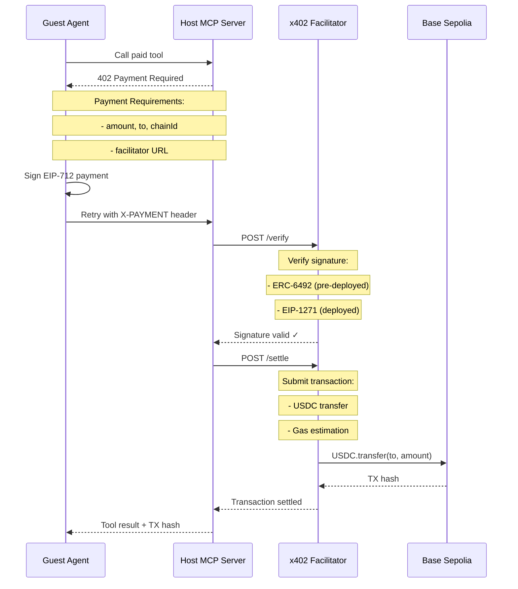

## Overview

The **x402 facilitator** is a critical service in the payment verification flow. It acts as a trusted third party that:

1. **Verifies payment signatures** (EIP-712, ERC-6492, EIP-1271)
2. **Settles transactions on-chain** (USDC transfers)
3. **Returns transaction hashes** for proof of payment

Think of the facilitator as the "payment processor" for autonomous agent payments—it bridges the gap between cryptographic signatures and on-chain settlement.

## Why Use a Facilitator?

<CardGroup cols={2}>
  <Card title="Signature Verification" icon="shield-check">
    Complex signature validation (ERC-6492 simulation, EIP-1271 calls) handled by the facilitator
  </Card>
  <Card title="On-Chain Settlement" icon="coins">
    Facilitator submits transactions to the blockchain and manages gas fees
  </Card>
  <Card title="Transaction Abstraction" icon="bolt">
    Host agents don't need direct blockchain access—just HTTP calls to facilitator
  </Card>
  <Card title="Error Recovery" icon="arrows-rotate">
    Facilitator handles nonce management, gas estimation, and transaction retries
  </Card>
</CardGroup>

## Architecture Position



## Facilitator Configuration

From `src/constants.ts`:

```typescript
export const FACILITATOR_URL = "https://x402.org/facilitator";
```

The facilitator URL is included in **402 Payment Required** responses:

```typescript host.ts
this.x402Config = {
  network: "base-sepolia",
  recipient: hostWalletAddress,
  facilitator: { url: FACILITATOR_URL }
};

this.server = withX402(
  new McpServer({ name: "Event RSVP MCP", version: "1.0.0" }),
  this.x402Config
);
```

## Payment Verification Flow

The facilitator handles the complete payment verification pipeline:

### Step 1: Guest Signs Payment

Guest agent receives 402 response and signs payment:

```json
{
  "statusCode": 402,
  "payment": {
    "amount": "50000",
    "currency": "USDC",
    "to": "0x742d35Cc6634C0532925a3b844Bc9e7595f0bEb",
    "chainId": 84532,
    "facilitator": "https://x402.org/facilitator"
  }
}
```

Guest signs EIP-712 typed data and retries with signature in `X-PAYMENT` header.

### Step 2: Host Forwards to Facilitator

Host MCP server extracts signature from header and sends to facilitator:

```typescript
// x402 SDK handles this automatically via withX402()
const response = await fetch(`${FACILITATOR_URL}/verify`, {
  method: "POST",
  headers: { "Content-Type": "application/json" },
  body: JSON.stringify({
    signature: paymentSignature,
    message: {
      amount: "50000",
      currency: USDC_ADDRESS,
      to: recipientAddress,
      nonce: paymentNonce
    },
    signer: guestWalletAddress,
    network: "base-sepolia"
  })
});

if (!response.ok) {
  throw new Error("Invalid payment signature");
}
```

### Step 3: Facilitator Verifies Signature

Facilitator performs cryptographic verification:

```typescript
// Pseudocode - facilitator internal logic
function verifySignature(signature, message, signer, network) {
  // Check wallet deployment status
  const isDeployed = await checkDeployment(signer, network);

  if (isDeployed) {
    // EIP-1271: Call wallet.isValidSignature(messageHash, signature)
    const valid = await verifyEIP1271(signer, message, signature, network);
    if (!valid) throw new Error("EIP-1271 verification failed");
  } else {
    // ERC-6492: Simulate deployment and verify
    if (!isERC6492(signature)) {
      throw new Error("Wallet not deployed and signature not ERC-6492 format");
    }
    const valid = await verifyERC6492(signer, message, signature, network);
    if (!valid) throw new Error("ERC-6492 verification failed");
  }

  return { verified: true };
}
```

See [ERC-6492 Validation](/api/erc-6492-validation) for pre-deployment signature details.

### Step 4: Facilitator Settles On-Chain

After signature verification, facilitator submits USDC transfer:

```typescript
// Pseudocode - facilitator settlement
async function settlePayment(from, to, amount, network) {
  const usdcContract = getUSDCContract(network);

  // If wallet is pre-deployed, deploy it first
  if (!isDeployed(from)) {
    await deployWallet(from);
  }

  // Execute USDC transfer from guest to host
  const tx = await usdcContract.transferFrom(from, to, amount);
  await tx.wait();  // Wait for confirmation

  return {
    success: true,
    transaction: tx.hash,
    network: network,
    payer: from,
    recipient: to,
    amount: amount
  };
}
```

### Step 5: Host Receives Confirmation

Facilitator returns settlement metadata:

```json
{
  "success": true,
  "transaction": "0xabc123def456...",
  "network": "base-sepolia",
  "payer": "0x123...",
  "recipient": "0x742...",
  "amount": "50000"
}
```

Host agent receives this and executes the paid tool.

## Response Format

From `src/agents/guest.ts:354-366`:

```typescript
// x402 SDK attaches settlement metadata to tool result
const paymentMeta = result._meta?.["x402/payment-response"];

if (paymentMeta?.transaction) {
  conn.send(JSON.stringify({
    type: "payment_receipt",
    txHash: paymentMeta.transaction,
    network: paymentMeta.network,
    payer: paymentMeta.payer
  }));
}
```

**Payment metadata structure**:
```typescript
interface PaymentResponse {
  success: boolean;
  transaction: string;  // TX hash on Base Sepolia
  network: string;      // "base-sepolia"
  payer: string;        // Guest wallet address
  recipient?: string;   // Host wallet address (optional)
  amount?: string;      // Payment amount in smallest unit (optional)
}
```

## Facilitator Responsibilities

<AccordionGroup>
  <Accordion title="Signature Verification">
    - **EIP-712**: Recover signer from typed data signature
    - **ERC-6492**: Simulate deployment and verify pre-deployed signatures
    - **EIP-1271**: Call `isValidSignature()` on deployed smart contracts
    - **Nonce validation**: Ensure nonces are not reused
  </Accordion>

  <Accordion title="On-Chain Settlement">
    - **Gas estimation**: Calculate required gas for USDC transfer
    - **Transaction submission**: Broadcast transaction to Base Sepolia
    - **Confirmation waiting**: Wait for block confirmation before returning
    - **Error handling**: Retry failed transactions with adjusted gas
  </Accordion>

  <Accordion title="Wallet Deployment">
    - **Deployment detection**: Check if wallet exists on-chain
    - **Auto-deployment**: Deploy pre-deployed wallets before first transfer
    - **Gas funding**: Ensure wallet has ETH for gas fees
  </Accordion>

  <Accordion title="Security & Validation">
    - **Amount verification**: Ensure signed amount matches request
    - **Recipient validation**: Verify payment goes to correct address
    - **Network checks**: Ensure transaction on correct chain
    - **Replay protection**: Prevent signature reuse via nonce tracking
  </Accordion>
</AccordionGroup>

## Running Your Own Facilitator

While the public facilitator at `https://x402.org/facilitator` works for development, you may want to run your own for production:

### Why Run Your Own?

<CardGroup cols={2}>
  <Card title="Control" icon="sliders">
    Full control over verification logic and settlement timing
  </Card>
  <Card title="Privacy" icon="lock">
    Payment data doesn't leave your infrastructure
  </Card>
  <Card title="Customization" icon="wrench">
    Add custom validation rules, rate limiting, or analytics
  </Card>
  <Card title="Reliability" icon="shield">
    No dependency on third-party service availability
  </Card>
</CardGroup>

### Basic Facilitator Implementation

```typescript
import { createPublicClient, createWalletClient, http } from "viem";
import { baseSepolia } from "viem/chains";
import { privateKeyToAccount } from "viem/accounts";

const USDC_ADDRESS = "0x036CbD53842c5426634e7929541eC2318f3dCF7e";

app.post("/verify", async (req, res) => {
  const { signature, message, signer, network } = req.body;

  try {
    // 1. Verify signature format
    const isValid = await verifySignature(signature, message, signer, network);
    if (!isValid) {
      return res.status(400).json({ error: "Invalid signature" });
    }

    res.json({ verified: true });
  } catch (error) {
    res.status(400).json({ error: error.message });
  }
});

app.post("/settle", async (req, res) => {
  const { from, to, amount, network } = req.body;

  try {
    // 2. Submit USDC transfer
    const walletClient = createWalletClient({
      chain: baseSepolia,
      transport: http("https://sepolia.base.org")
    });

    const txHash = await walletClient.writeContract({
      address: USDC_ADDRESS,
      abi: usdcAbi,
      functionName: "transferFrom",
      args: [from, to, BigInt(amount)]
    });

    // 3. Wait for confirmation
    const publicClient = createPublicClient({
      chain: baseSepolia,
      transport: http("https://sepolia.base.org")
    });

    await publicClient.waitForTransactionReceipt({ hash: txHash });

    res.json({
      success: true,
      transaction: txHash,
      network,
      payer: from,
      recipient: to,
      amount
    });
  } catch (error) {
    res.status(500).json({ error: error.message });
  }
});
```

### Deployment Checklist

<Steps>
  <Step title="RPC Access">
    Set up Base Sepolia RPC endpoint (e.g., via Alchemy, Infura, or public RPC).
  </Step>

  <Step title="Wallet Setup">
    Create a wallet for submitting transactions (needs ETH for gas).
  </Step>

  <Step title="USDC Approval">
    Ensure payers approve your facilitator to spend their USDC.
  </Step>

  <Step title="Signature Verification">
    Implement EIP-712, ERC-6492, and EIP-1271 verification logic.
  </Step>

  <Step title="Error Handling">
    Handle gas estimation failures, nonce conflicts, and network issues.
  </Step>

  <Step title="Monitoring">
    Add logging and alerts for failed settlements.
  </Step>
</Steps>

## Security Considerations

<Warning>
  The facilitator is a **trusted component** in the payment flow. Ensure:
  - **Signature verification is robust** - Never skip validation steps
  - **Nonce tracking prevents replay** - Store used nonces in a database
  - **Rate limiting protects against abuse** - Limit verification requests per wallet
  - **Settlement is atomic** - Either verify AND settle, or fail completely
</Warning>

### Nonce Management

```typescript
// Store used nonces to prevent replay attacks
const usedNonces = new Set<string>();

app.post("/verify", async (req, res) => {
  const { message } = req.body;
  const nonceKey = `${message.to}:${message.nonce}`;

  if (usedNonces.has(nonceKey)) {
    return res.status(400).json({ error: "Nonce already used (replay attack?)" });
  }

  // Verify signature...

  // Mark nonce as used
  usedNonces.add(nonceKey);

  res.json({ verified: true });
});
```

### Amount Validation

```typescript
app.post("/settle", async (req, res) => {
  const { amount, expectedAmount } = req.body;

  // Ensure signed amount matches expected amount
  if (BigInt(amount) < BigInt(expectedAmount)) {
    return res.status(400).json({ error: "Insufficient payment amount" });
  }

  // Proceed with settlement...
});
```

## Testing Facilitator Integration

```typescript
// Test signature verification
const testPayment = {
  signature: "0x...",  // EIP-712 signature
  message: {
    amount: "50000",
    currency: USDC_ADDRESS,
    to: "0x742d35...",
    nonce: Date.now()
  },
  signer: "0x123...",  // Guest wallet
  network: "base-sepolia"
};

const verifyResponse = await fetch(`${FACILITATOR_URL}/verify`, {
  method: "POST",
  headers: { "Content-Type": "application/json" },
  body: JSON.stringify(testPayment)
});

const verifyResult = await verifyResponse.json();
console.log("Verification:", verifyResult);
// Expected: { verified: true }

// Test settlement
const settleResponse = await fetch(`${FACILITATOR_URL}/settle`, {
  method: "POST",
  headers: { "Content-Type": "application/json" },
  body: JSON.stringify({
    from: testPayment.signer,
    to: testPayment.message.to,
    amount: testPayment.message.amount,
    network: "base-sepolia"
  })
});

const settleResult = await settleResponse.json();
console.log("Settlement:", settleResult);
// Expected: { success: true, transaction: "0x...", ... }
```

## Error Codes

| Code | Error | Cause | Solution |
|------|-------|-------|----------|
| 400 | Invalid signature | Signature verification failed | Check EIP-712 payload matches signed message |
| 400 | Nonce already used | Replay attack detected | Generate new nonce for payment |
| 400 | Insufficient amount | Signed amount < required | Sign with correct payment amount |
| 500 | Settlement failed | Transaction reverted or gas issues | Check wallet has USDC and ETH for gas |
| 503 | RPC unavailable | Blockchain node unreachable | Retry or switch RPC endpoint |

## Implementation Checklist

<Steps>
  <Step title="Configure Facilitator URL">
    Set `FACILITATOR_URL` in your constants or environment variables.
  </Step>

  <Step title="Include in 402 Responses">
    Add facilitator URL to payment requirements via x402 config.
  </Step>

  <Step title="Forward Signatures">
    Let x402 SDK handle forwarding signatures to facilitator (automatic).
  </Step>

  <Step title="Handle Settlement Metadata">
    Extract transaction hash from `_meta["x402/payment-response"]` in tool results.
  </Step>

  <Step title="Display Receipts">
    Show transaction links to users (e.g., BaseScan explorer).
  </Step>
</Steps>

## Related Topics

<CardGroup cols={2}>
  <Card title="EIP-712 Signatures" icon="pen" href="/api/eip-712-signatures">
    Typed data signing for payments
  </Card>
  <Card title="ERC-6492 Validation" icon="shield" href="/api/erc-6492-validation">
    Pre-deployment signature verification
  </Card>
</CardGroup>

## References

- [x402 Protocol Specification](https://x402.org)
- [Base Sepolia Explorer](https://sepolia.basescan.org/)
- Source: `events-concierge/src/constants.ts:9`
- Source: `events-concierge/src/agents/host.ts:268-272`
