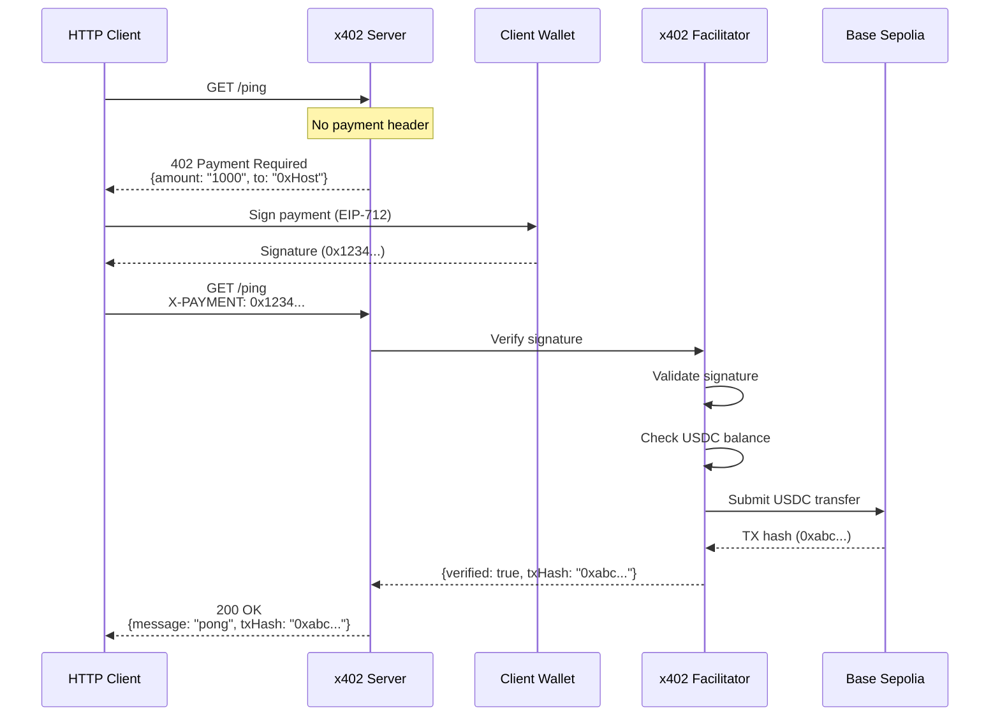
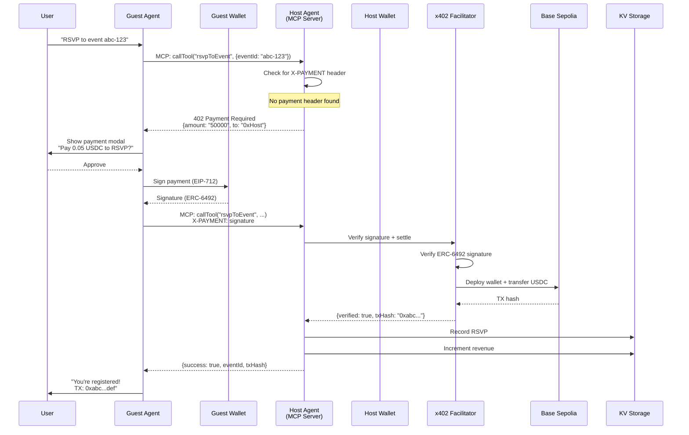
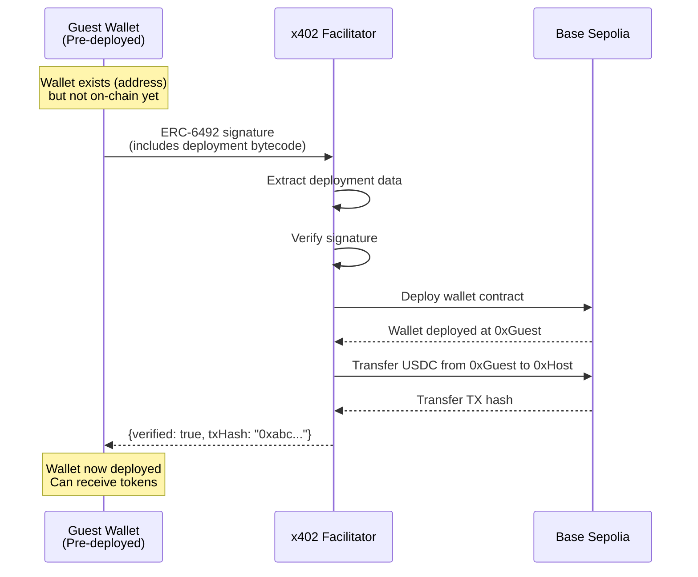
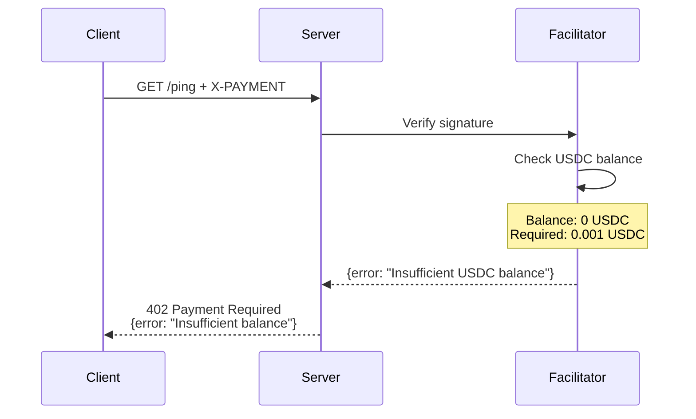
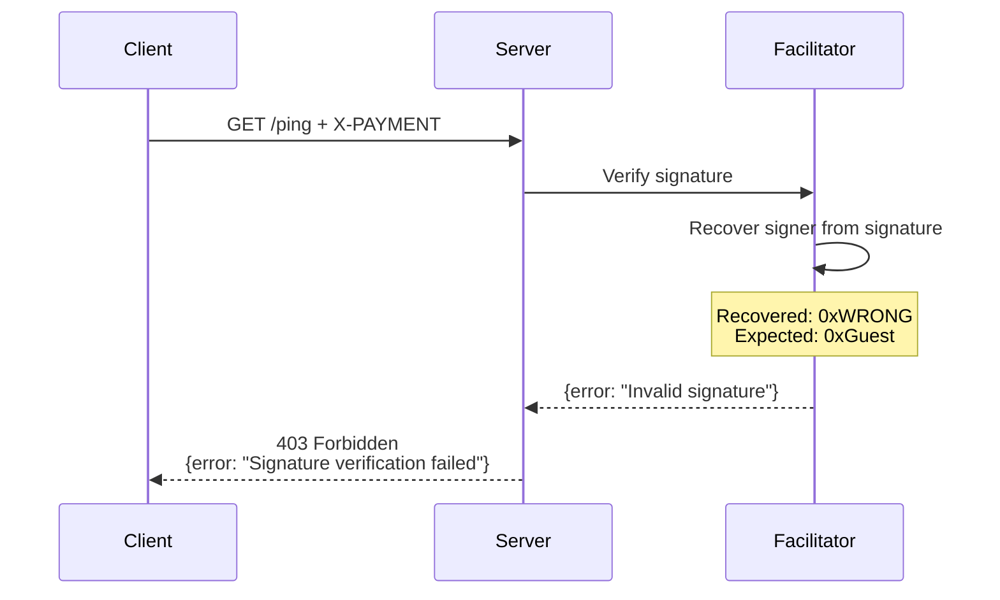
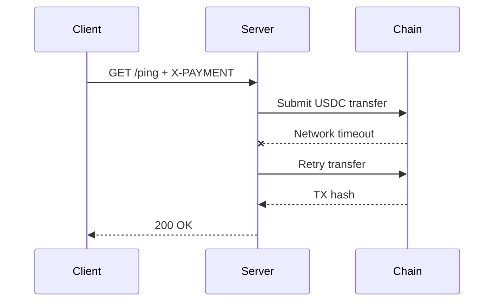

## Overview

This guide walks through complete payment flows for Crossmint Agentic Finance, from initial request to on-chain settlement. We'll cover both simple HTTP paywalls and complex agent-to-agent transactions.

## Simple HTTP Paywall Flow

The most basic x402 flow: a client pays to access a protected API endpoint.

### Sequence Diagram



### Step-by-Step Breakdown

<Steps>
  <Step title="Client Makes Initial Request">
    Client attempts to access protected endpoint without payment:
    
    ```bash
    curl -i http://localhost:3000/ping
    ```
    
    **Request headers:**
    ```http
    GET /ping HTTP/1.1
    Host: localhost:3000
    Accept: application/json
    ```
  </Step>
  
  <Step title="Server Returns 402 Payment Required">
    Server detects missing payment, returns requirement:
    
    ```http
    HTTP/1.1 402 Payment Required
    Content-Type: application/json
    
    {
      "payment": {
        "amount": "1000",
        "currency": "USDC",
        "to": "0x742d35Cc6634C0532925a3b844Bc9e7595f0bEb",
        "chainId": 84532,
        "network": "base-sepolia",
        "facilitator": "https://x402.org/facilitator"
      }
    }
    ```
    
    See [ping/src/server.ts:11-12](https://github.com/crossmint/crossmint-agentic-finance/blob/main/ping/src/server.ts#L11-L12)
  </Step>
  
  <Step title="Client Signs Payment Message">
    Client creates EIP-712 signature:
    
    ```typescript
    const signature = await wallet.signTypedData({
      domain: {
        name: "x402 Payment",
        version: "1",
        chainId: 84532,
        verifyingContract: "0x036CbD53842c5426634e7929541eC2318f3dCF7e"
      },
      types: {
        Payment: [
          { name: "amount", type: "uint256" },
          { name: "currency", type: "address" },
          { name: "to", type: "address" },
          { name: "nonce", type: "uint256" }
        ]
      },
      primaryType: "Payment",
      message: {
        amount: "1000",
        currency: "0x036CbD53842c5426634e7929541eC2318f3dCF7e",
        to: "0x742d35Cc6634C0532925a3b844Bc9e7595f0bEb",
        nonce: Date.now()
      }
    });
    
    console.log(signature);
    // 0x1234567890abcdef...
    ```
    
    **For pre-deployed wallets:** Signature includes ERC-6492 wrapper
  </Step>
  
  <Step title="Client Retries with Payment Header">
    Client includes signature in retry request:
    
    ```bash
    curl -i \
      -H "X-PAYMENT: 0x1234567890abcdef..." \
      http://localhost:3000/ping
    ```
    
    **Request headers:**
    ```http
    GET /ping HTTP/1.1
    Host: localhost:3000
    Accept: application/json
    X-PAYMENT: 0x1234567890abcdef...
    ```
  </Step>
  
  <Step title="Server Verifies Signature">
    Server calls facilitator to verify signature:
    
    ```typescript
    const response = await fetch(
      "https://x402.org/facilitator/verify",
      {
        method: "POST",
        headers: { "Content-Type": "application/json" },
        body: JSON.stringify({
          signature: "0x1234...",
          message: {
            amount: "1000",
            currency: "0x036CbD...",
            to: "0x742d35...",
            nonce: 1234567890
          },
          signer: "0xClientWallet"
        })
      }
    );
    
    const { verified, txHash } = await response.json();
    ```
  </Step>
  
  <Step title="Facilitator Settles On-Chain">
    Facilitator validates and submits USDC transfer:
    
    ```typescript
    // 1. Verify signature matches message
    const recoveredSigner = recoverTypedDataSigner({
      signature,
      message,
      types,
      domain
    });
    
    if (recoveredSigner !== expectedSigner) {
      throw new Error("Invalid signature");
    }
    
    // 2. Check USDC balance
    const balance = await usdcContract.balanceOf(signer);
    if (balance < amount) {
      throw new Error("Insufficient USDC balance");
    }
    
    // 3. Submit transfer transaction
    const tx = await usdcContract.transfer(
      to,
      amount,
      { from: signer }
    );
    
    return { verified: true, txHash: tx.hash };
    ```
  </Step>
  
  <Step title="Server Returns Success">
    Server responds with data and transaction proof:
    
    ```http
    HTTP/1.1 200 OK
    Content-Type: application/json
    X-Transaction-Hash: 0xabc...def
    
    {
      "message": "pong",
      "transactionHash": "0xabc...def"
    }
    ```
    
    Client can verify transaction on Base Sepolia explorer:
    ```
    https://sepolia.basescan.org/tx/0xabc...def
    ```
  </Step>
</Steps>

## Agent-to-Agent MCP Flow

More complex flow involving two agents communicating via Model Context Protocol (MCP).

### Sequence Diagram



### Step-by-Step Breakdown

<Steps>
  <Step title="User Requests Action">
    User asks their agent to perform a paid action:
    
    ```
    User: "RSVP to event abc-123"
    ```
    
    Guest agent detects this requires calling the `rsvpToEvent` MCP tool.
  </Step>
  
  <Step title="Guest Agent Calls MCP Tool">
    Guest makes MCP tool call to Host:
    
    ```typescript
    const result = await mcpClient.callTool("rsvpToEvent", {
      eventId: "abc-123",
      walletAddress: guestWallet.address
    });
    ```
    
    **MCP Request:**
    ```json
    {
      "jsonrpc": "2.0",
      "method": "tools/call",
      "params": {
        "name": "rsvpToEvent",
        "arguments": {
          "eventId": "abc-123",
          "walletAddress": "0xGuestWallet"
        }
      }
    }
    ```
    
    See [events-concierge/src/agents/guest.ts](https://github.com/crossmint/crossmint-agentic-finance/blob/main/events-concierge/src/agents/guest.ts)
  </Step>
  
  <Step title="Host Returns 402 Payment Required">
    Host MCP server checks for payment, finds none:
    
    ```typescript
    // In Host's paidTool handler
    this.server.paidTool(
      "rsvpToEvent",
      "RSVP to an event",
      0.05,  // Price
      { eventId: z.string(), walletAddress: z.string() },
      async ({ eventId, walletAddress }) => {
        // This only runs AFTER payment verified
        await recordRsvp(eventId, walletAddress);
      }
    );
    ```
    
    **402 Response:**
    ```json
    {
      "statusCode": 402,
      "payment": {
        "amount": "50000",
        "currency": "USDC",
        "to": "0xHostWallet",
        "chainId": 84532,
        "facilitator": "https://x402.org/facilitator"
      }
    }
    ```
    
    See [events-concierge/src/agents/host.ts:158-202](https://github.com/crossmint/crossmint-agentic-finance/blob/main/events-concierge/src/agents/host.ts#L158-L202)
  </Step>
  
  <Step title="Guest Confirms Payment with User">
    Guest agent's `onPaymentRequired` callback triggers:
    
    ```typescript
    mcpClient.withX402Client({
      wallet: guestWallet,
      onPaymentRequired: async (requirement, retryFn) => {
        // Show modal to user
        const approved = await showPaymentModal({
          amount: "0.05 USDC",
          recipient: "Event Host",
          action: "RSVP to event abc-123"
        });
        
        if (!approved) {
          throw new Error("Payment declined by user");
        }
        
        // Continue to signing...
      }
    });
    ```
    
    User sees clear payment details and approves.
  </Step>
  
  <Step title="Guest Wallet Signs Payment">
    Guest wallet creates ERC-6492 signature (pre-deployed):
    
    ```typescript
    const signature = await guestWallet.signTypedData({
      domain: {
        name: "x402 Payment",
        version: "1",
        chainId: 84532,
        verifyingContract: "0x036CbD53842c5426634e7929541eC2318f3dCF7e"
      },
      types: {
        Payment: [
          { name: "amount", type: "uint256" },
          { name: "currency", type: "address" },
          { name: "to", type: "address" },
          { name: "nonce", type: "uint256" }
        ]
      },
      primaryType: "Payment",
      message: {
        amount: "50000",
        currency: "0x036CbD53842c5426634e7929541eC2318f3dCF7e",
        to: "0xHostWallet",
        nonce: Date.now()
      }
    });
    ```
    
    **Signature includes:**
    - Factory address
    - Deployment bytecode
    - Inner signature
    - ERC-6492 magic suffix
  </Step>
  
  <Step title="Guest Retries with Payment">
    Guest retries MCP call with `X-PAYMENT` header:
    
    ```typescript
    const result = await retryFn(signature);
    ```
    
    **MCP Request:**
    ```json
    {
      "jsonrpc": "2.0",
      "method": "tools/call",
      "params": {
        "name": "rsvpToEvent",
        "arguments": {
          "eventId": "abc-123",
          "walletAddress": "0xGuestWallet"
        }
      },
      "headers": {
        "X-PAYMENT": "0x1234567890abcdef..."
      }
    }
    ```
  </Step>
  
  <Step title="Host Verifies & Settles Payment">
    Host calls facilitator to verify signature and settle:
    
    ```typescript
    const response = await fetch(
      `${FACILITATOR_URL}/verify`,
      {
        method: "POST",
        body: JSON.stringify({
          signature,
          message: paymentMessage,
          signer: guestWallet.address
        })
      }
    );
    
    const { verified, txHash } = await response.json();
    
    if (!verified) {
      throw new Error("Payment verification failed");
    }
    ```
    
    **Facilitator:**
    1. Verifies ERC-6492 signature
    2. Deploys guest wallet (if not already deployed)
    3. Executes USDC transfer from guest to host
    4. Returns transaction hash
  </Step>
  
  <Step title="Host Records RSVP & Revenue">
    After payment verified, Host executes business logic:
    
    ```typescript
    // Record RSVP in KV storage
    await kv.put(
      `${userScopeId}:events:${eventId}:rsvps:${walletAddress}`,
      JSON.stringify({
        walletAddress,
        timestamp: Date.now(),
        txHash,
        amount: "50000"
      })
    );
    
    // Increment revenue counter
    const revenueKey = `${userScopeId}:revenue`;
    const currentRevenue = parseInt(
      await kv.get(revenueKey) || "0"
    );
    await kv.put(
      revenueKey,
      (currentRevenue + 50000).toString()
    );
    ```
    
    See [events-concierge/src/shared/eventService.ts](https://github.com/crossmint/crossmint-agentic-finance/blob/main/events-concierge/src/shared/eventService.ts)
  </Step>
  
  <Step title="Host Returns Success">
    Host returns MCP tool result:
    
    ```json
    {
      "content": [{
        "type": "text",
        "text": {
          "success": true,
          "eventId": "abc-123",
          "eventTitle": "Tech Meetup",
          "transactionHash": "0xabc...def",
          "message": "RSVP successful! Paid 0.05 USDC."
        }
      }]
    }
    ```
  </Step>
  
  <Step title="Guest Confirms to User">
    Guest agent displays confirmation:
    
    ```
    Guest Agent: ✅ You're registered for "Tech Meetup"!
    Guest Agent: 💰 Payment: 0.05 USDC
    Guest Agent: 🔗 Transaction: 0xabc...def
    Guest Agent: 🌐 Explorer: https://sepolia.basescan.org/tx/0xabc...def
    ```
    
    User has blockchain proof of payment and registration.
  </Step>
</Steps>

## Wallet Deployment Flow

Special case: Guest wallet's first payment also deploys the wallet on-chain.

### Sequence Diagram



### ERC-6492 Signature Structure

```typescript
// ERC-6492 signature format
[
  factoryAddress,      // 20 bytes: Wallet factory contract
  factoryCalldata,     // Variable: Deployment parameters
  innerSignature,      // 65 bytes: Actual EIP-712 signature
  magicSuffix          // 32 bytes: "6492649264926492..."
]
```

**Verification process:**

```typescript
function verifyERC6492(signature: string, message: any, signer: string) {
  // 1. Check for magic suffix
  if (!signature.endsWith("6492649264926492...")) {
    return verifyStandardSignature(signature, message, signer);
  }
  
  // 2. Extract components
  const { factory, calldata, innerSig } = decode(signature);
  
  // 3. Compute expected wallet address
  const expectedAddress = computeCreate2Address(factory, calldata);
  
  // 4. Verify address matches
  if (expectedAddress !== signer) {
    throw new Error("Address mismatch");
  }
  
  // 5. Deploy wallet (if needed)
  if (!isDeployed(expectedAddress)) {
    await deployContract(factory, calldata);
  }
  
  // 6. Verify inner signature
  return verifySignature(innerSig, message, expectedAddress);
}
```

See [x402Adapter.ts:79-111](https://github.com/crossmint/crossmint-agentic-finance/blob/main/events-concierge/src/x402Adapter.ts#L79-L111)

## Error Scenarios

Real-world payment flows must handle errors gracefully.

### Insufficient Balance



**Client handling:**

```typescript
try {
  const result = await client.get("/ping", { payment: signature });
} catch (error) {
  if (error.message.includes("Insufficient")) {
    console.log("❌ Please add USDC to your wallet");
    console.log(`🔗 Address: ${wallet.address}`);
    console.log(`🪙 Get testnet USDC: https://faucet.circle.com/`);
  }
}
```

### Invalid Signature



**Common causes:**
- Wrong chain ID in domain
- Incorrect message structure
- Tampered signature
- Wrong signer address

### Network Failure



**Retry logic:**

```typescript
async function settlePayment(signature: string, maxRetries = 3) {
  for (let i = 0; i < maxRetries; i++) {
    try {
      const tx = await chain.submitTransaction(signature);
      return tx.hash;
    } catch (error) {
      if (i === maxRetries - 1) throw error;
      await sleep(1000 * Math.pow(2, i));  // Exponential backoff
    }
  }
}
```

## Best Practices

<AccordionGroup>
  <Accordion title="Always Verify Server-Side" icon="server">
    Never trust client-provided payment claims:
    
    ```typescript
    // ❌ DON'T
    if (request.headers.get("X-PAYMENT-VERIFIED") === "true") {
      executeBusinessLogic();
    }
    
    // ✅ DO
    const signature = request.headers.get("X-PAYMENT");
    const verified = await facilitator.verify(signature, message);
    if (verified) {
      executeBusinessLogic();
    }
    ```
  </Accordion>
  
  <Accordion title="Store Transaction Hashes" icon="receipt">
    Keep permanent records of all payments:
    
    ```typescript
    await kv.put(`payments:${txHash}`, JSON.stringify({
      from: guestWallet,
      to: hostWallet,
      amount: "50000",
      timestamp: Date.now(),
      eventId: "abc-123",
      status: "confirmed"
    }));
    ```
  </Accordion>
  
  <Accordion title="Show Transaction Proofs to Users" icon="eye">
    Always display blockchain proof:
    
    ```typescript
    console.log(`✅ Payment confirmed!`);
    console.log(`Amount: 0.05 USDC`);
    console.log(`TX: ${txHash}`);
    console.log(`Explorer: https://sepolia.basescan.org/tx/${txHash}`);
    ```
  </Accordion>
  
  <Accordion title="Handle Pre-Deployed Wallets" icon="wallet">
    Support both pre-deployed and deployed wallets:
    
    ```typescript
    const signature = await wallet.signTypedData(message);
    
    // Check if ERC-6492 (pre-deployed)
    if (signature.endsWith("6492649264926492...")) {
      console.log("⚠️ Wallet will be deployed with first payment");
    }
    ```
  </Accordion>
  
  <Accordion title="Implement Idempotency" icon="arrows-rotate">
    Use nonces to prevent duplicate payments:
    
    ```typescript
    const nonce = `${Date.now()}-${randomUUID()}`;
    
    // Before processing
    const alreadyProcessed = await kv.get(`nonce:${nonce}`);
    if (alreadyProcessed) {
      return { error: "Payment already processed" };
    }
    
    // After processing
    await kv.put(`nonce:${nonce}`, "processed");
    ```
  </Accordion>
</AccordionGroup>

## Monitoring & Debugging

### Log Payment Events

```typescript
console.log("💳 Payment flow started");
console.log(`  From: ${guestWallet}`);
console.log(`  To: ${hostWallet}`);
console.log(`  Amount: ${amount}`);

try {
  const signature = await wallet.signTypedData(message);
  console.log(`✅ Signature created: ${signature.substring(0, 20)}...`);
  
  const { verified, txHash } = await facilitator.verify(signature);
  console.log(`✅ Payment verified`);
  console.log(`  TX Hash: ${txHash}`);
  console.log(`  Block: ${blockNumber}`);
  
  await recordPayment({ txHash, amount, ...});
  console.log(`✅ Payment recorded`);
  
} catch (error) {
  console.log(`❌ Payment failed: ${error.message}`);
  console.log(`  Stack: ${error.stack}`);
}
```

### Track Revenue

```typescript
// Real-time revenue tracking
const revenue = await kv.get(`${userId}:revenue`);
const usd = parseInt(revenue) / 1000000;  // Convert from USDC decimals

console.log(`💰 Total revenue: $${usd.toFixed(2)}`);
```

### Monitor Failed Payments

```typescript
// Log all failures
await kv.put(`failed-payments:${Date.now()}`, JSON.stringify({
  from: guestWallet,
  to: hostWallet,
  amount,
  error: error.message,
  signature
}));

// Alert on threshold
const failures = await kv.list({ prefix: "failed-payments:" });
if (failures.length > 10) {
  await alertTeam("High payment failure rate");
}
```

## Next Steps

<CardGroup cols={2}>
  <Card title="x402 Protocol" icon="credit-card" href="/concepts/x402-protocol">
    Learn the HTTP payment protocol
  </Card>
  <Card title="A2A Payments" icon="arrows-turn-to-dots" href="/concepts/a2a-payments">
    Build agent-to-agent systems
  </Card>
  <Card title="Smart Wallets" icon="wallet" href="/concepts/smart-wallets">
    Deep dive into wallet features
  </Card>
  <Card title="Build Your Own" icon="rocket" href="/quickstart">
    Create your first payment flow
  </Card>
</CardGroup>

## Resources

- [x402 Protocol Specification](https://x402.org)
- [Model Context Protocol](https://modelcontextprotocol.io)
- [EIP-712: Typed Data Signing](https://eips.ethereum.org/EIPS/eip-712)
- [ERC-6492: Pre-Deployment Signatures](https://eips.ethereum.org/EIPS/eip-6492)
- [Base Sepolia Explorer](https://sepolia.basescan.org/)
