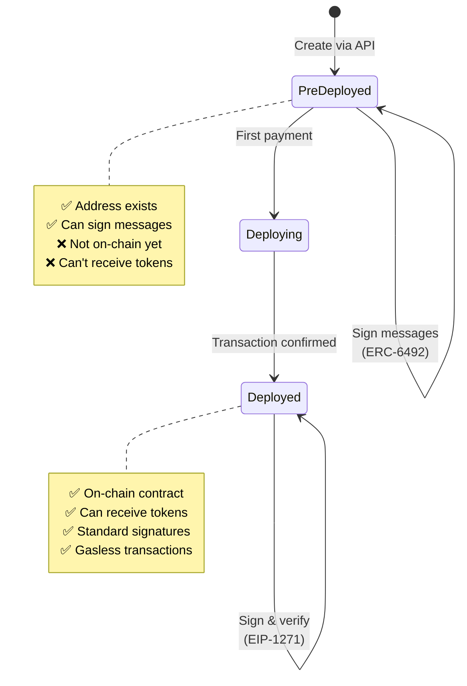

## Overview

Crossmint smart wallets are ERC-4337 compliant smart contract accounts that work before deployment. They enable autonomous agent payments without private key management.

**Key features:**

<CardGroup cols={2}>
  <Card title="No Private Keys" icon="key-skeleton">
    Controlled via API or email OTP—no key files to manage
  </Card>
  <Card title="Pre-Deployment Signing" icon="signature">
    Sign transactions before wallet exists on-chain (ERC-6492)
  </Card>
  <Card title="Auto-Deployment" icon="rocket">
    Deploys automatically on first transaction
  </Card>
  <Card title="Smart Contract Signatures" icon="file-signature">
    Validate signatures via EIP-1271 after deployment
  </Card>
</CardGroup>

## Why Smart Wallets?

Traditional EOA (Externally Owned Account) wallets have major limitations for agents:

| Challenge | EOA Wallet | Smart Wallet |
|-----------|------------|-------------|
| **Private Key Management** | ❌ Must store/manage keys | ✅ API-based control |
| **Deployment Cost** | ✅ Free (just address) | ✅ Free until first use |
| **Signature Validation** | ✅ Standard ECDSA | ✅ Custom logic via EIP-1271 |
| **Gas Abstraction** | ❌ Must hold ETH for gas | ✅ Sponsor gas or use paymasters |
| **Multi-sig** | ❌ Not supported | ✅ Built-in support |
| **Recovery** | ❌ Lose key = lose wallet | ✅ Social recovery possible |
| **Batch Transactions** | ❌ One at a time | ✅ Multiple ops in one TX |

**Smart wallets are purpose-built for agents.**

## Creating a Wallet

Crossmint wallets can be created server-side (API key) or client-side (email OTP):

### Server-Side (API Key)

Perfect for backend agents that need autonomous payment capabilities:

```typescript
import { createCrossmint, CrossmintWallets } from "@crossmint/wallets-sdk";

const crossmint = createCrossmint({
  apiKey: process.env.CROSSMINT_API_KEY
});

const crossmintWallets = CrossmintWallets.from(crossmint);

const wallet = await crossmintWallets.createWallet({
  chain: "base-sepolia",
  signer: { type: "api-key" },
  owner: "userId:my-guest-agent:evm:smart"
});

console.log("Wallet address:", wallet.address);
// 0x742d35Cc6634C0532925a3b844Bc9e7595f0bEb
```

See [events-concierge/src/agents/host.ts:245-254](https://github.com/crossmint/crossmint-agentic-finance/blob/main/events-concierge/src/agents/host.ts#L245-L254)

### Client-Side (Email OTP)

Perfect for user-controlled wallets with email authentication:

```typescript
import { CrossmintEmbeddedWallet } from "@crossmint/client-sdk-react-ui";

const { login } = useCrossmintWallet();

// Trigger email OTP
await login({ email: "user@example.com" });

// User enters code, wallet is created
const wallet = await crossmintWallets.getWallet();
```

<Info>
  **Owner identifiers** like `userId:my-guest-agent:evm:smart` ensure consistent wallet addresses across sessions. Same owner ID = same wallet address.
</Info>

## Wallet Lifecycle

Smart wallets go through three stages:



### Stage 1: Pre-Deployed

Wallet has an address but doesn't exist on-chain yet:

```typescript
const wallet = await crossmintWallets.createWallet({
  chain: "base-sepolia",
  signer: { type: "api-key" }
});

console.log("Address:", wallet.address);
// 0x742d35Cc6634C0532925a3b844Bc9e7595f0bEb

// Check deployment status
const isDeployed = await checkWalletDeployment(
  wallet.address,
  "base-sepolia"
);
console.log("Deployed:", isDeployed);  // false
```

**Can do:**
- Generate signatures
- Sign EIP-712 typed data
- Sign payment messages

**Cannot do:**
- Receive USDC or other tokens
- Make on-chain transactions

### Stage 2: Deploying

First payment triggers automatic deployment:

```typescript
// Guest signs payment (pre-deployed wallet)
const signature = await wallet.signTypedData({
  domain: { chainId: 84532, ... },
  types: { Payment: [...] },
  message: {
    amount: "50000",
    to: "0xHostWallet",
    currency: "0xUSDC"
  }
});

// Facilitator deploys wallet + settles payment
const tx = await facilitator.settle(signature);

console.log("Deployment TX:", tx.hash);
// 0xabc...def
```

**What happens:**
1. Facilitator extracts deployment bytecode from ERC-6492 signature
2. Deploys wallet contract to computed address
3. Executes USDC transfer in same transaction
4. Wallet is now on-chain

### Stage 3: Deployed

Wallet exists on-chain as a smart contract:

```typescript
const isDeployed = await checkWalletDeployment(
  wallet.address,
  "base-sepolia"
);
console.log("Deployed:", isDeployed);  // true

// Can now receive tokens
await usdcContract.transfer(wallet.address, "1000000");

// Signatures validated via EIP-1271
const signature = await wallet.signMessage("Hello");
const valid = await wallet.isValidSignature("Hello", signature);
```

**Benefits:**
- Receive USDC and other tokens
- Execute arbitrary transactions
- Gasless operations (with paymasters)
- Batch multiple operations

## ERC-6492: Pre-Deployment Signatures

ERC-6492 allows wallets to sign messages before deployment by wrapping signatures with deployment bytecode.

### How It Works

```typescript
// 1. Wallet signs message (pre-deployed)
const baseSignature = await wallet.signTypedData(paymentMessage);

// 2. Crossmint wraps with deployment data
const erc6492Signature = [
  factoryAddress,    // Contract factory
  factoryCalldata,   // Deployment parameters
  baseSignature      // Actual signature
].encode();

// 3. Add ERC-6492 magic suffix
const finalSignature = erc6492Signature + "6492649264926492...";
```

### Verification Process

Verifiers simulate deployment, then check signature:

```typescript
// Verifier receives ERC-6492 signature
function verifyERC6492(signature, message, expectedSigner) {
  // 1. Check for magic suffix
  if (signature.endsWith("6492649264926492...")) {
    // 2. Extract deployment data
    const { factory, calldata, innerSig } = decode(signature);
    
    // 3. Simulate deployment
    const simulatedAddress = computeAddress(factory, calldata);
    
    // 4. Check address matches
    if (simulatedAddress !== expectedSigner) {
      throw new Error("Address mismatch");
    }
    
    // 5. Verify signature against simulated contract
    return verifySmartContractSignature(
      simulatedAddress,
      innerSig,
      message
    );
  }
  
  // Standard ECDSA verification
  return verifyECDSA(signature, message, expectedSigner);
}
```

**Key insight:** The wallet's address is deterministic (based on factory + parameters), so verifiers can compute it without deployment.

See [x402Adapter.ts:79-111](https://github.com/crossmint/crossmint-agentic-finance/blob/main/events-concierge/src/x402Adapter.ts#L79-L111)

## EIP-1271: Smart Contract Signatures

After deployment, wallets use EIP-1271 for signature validation:

### The Interface

Smart contract wallets implement `isValidSignature()`:

```solidity
interface IERC1271 {
  /**
   * @dev Should return whether the signature provided is valid for the provided data
   * @param hash      Hash of the data to be signed
   * @param signature Signature byte array associated with _data
   */
  function isValidSignature(
    bytes32 hash,
    bytes memory signature
  ) external view returns (bytes4 magicValue);
}
```

**Magic value:** `0x1626ba7e` means signature is valid.

### Verification Flow

```typescript
import { verifyTypedData } from "viem";

// For deployed smart wallets
const valid = await publicClient.call({
  address: wallet.address,
  abi: ERC1271_ABI,
  functionName: "isValidSignature",
  args: [messageHash, signature]
});

if (valid === "0x1626ba7e") {
  console.log("✅ Signature valid");
} else {
  console.log("❌ Signature invalid");
}
```

### Custom Validation Logic

Smart wallets can implement custom signature validation:

```solidity
contract CrossmintSmartWallet {
  mapping(address => bool) public owners;
  
  function isValidSignature(
    bytes32 hash,
    bytes memory signature
  ) external view returns (bytes4) {
    // Recover signer from signature
    address signer = recoverSigner(hash, signature);
    
    // Check if signer is an owner
    if (owners[signer]) {
      return 0x1626ba7e;  // Valid
    }
    
    return 0xffffffff;  // Invalid
  }
}
```

**Possibilities:**
- Multi-sig (require N of M owners)
- Time-locked signatures
- Spending limits
- Session keys
- Social recovery

## x402 Integration

Crossmint wallets integrate seamlessly with x402 via an adapter:

```typescript x402Adapter.ts
import { Wallet, EVMWallet } from "@crossmint/wallets-sdk";
import type { Hex } from "viem";

/**
 * Create an x402-compatible signer from Crossmint wallet
 */
export function createX402Signer(wallet: Wallet<any>) {
  const evm = EVMWallet.from(wallet);

  return {
    address: evm.address as `0x${string}`,
    type: "local",
    
    // x402 calls this to sign payments
    signTypedData: async (params: any) => {
      const { domain, message, primaryType, types } = params;
      
      // Sign with Crossmint
      const sig = await evm.signTypedData({
        domain,
        message,
        primaryType,
        types,
        chain: evm.chain
      });
      
      // Process signature (handles ERC-6492)
      return processSignature(sig.signature);
    }
  };
}

function processSignature(rawSignature: string): Hex {
  const signature = rawSignature.startsWith('0x') 
    ? rawSignature 
    : `0x${rawSignature}`;

  // ERC-6492 (pre-deployed) - keep as-is
  if (signature.endsWith("6492649264926492649264926492649264926492649264926492649264926492")) {
    return signature as Hex;
  }

  // EIP-1271 (deployed) - 174 chars
  if (signature.length === 174) {
    return signature as Hex;
  }

  // Standard ECDSA - 132 chars
  if (signature.length === 132) {
    return signature as Hex;
  }

  // Fallback: extract standard signature
  return ('0x' + signature.slice(-130)) as Hex;
}
```

See [x402Adapter.ts](https://github.com/crossmint/crossmint-agentic-finance/blob/main/events-concierge/src/x402Adapter.ts)

**Usage:**

```typescript
const crossmintWallet = await crossmintWallets.createWallet({...});
const x402Signer = createX402Signer(crossmintWallet);

const server = new McpServer({ name: "Event Host" })
  .withX402({
    wallet: x402Signer,  // Works with x402!
    network: "base-sepolia",
    recipient: hostAddress
  });
```

## Checking Deployment Status

You can check if a wallet is deployed:

```typescript
import { createPublicClient, http } from "viem";
import { baseSepolia } from "viem/chains";

export async function checkWalletDeployment(
  walletAddress: string,
  chain: string
): Promise<boolean> {
  const publicClient = createPublicClient({
    chain: baseSepolia,
    transport: http("https://sepolia.base.org")
  });

  const code = await publicClient.getCode({
    address: walletAddress as `0x${string}`
  });

  // If bytecode exists, wallet is deployed
  return code !== undefined && code !== '0x' && code.length > 2;
}
```

**Usage:**

```typescript
const deployed = await checkWalletDeployment(
  wallet.address,
  "base-sepolia"
);

if (deployed) {
  console.log("✅ Wallet deployed, can receive tokens");
} else {
  console.log("⚠️ Wallet not deployed yet");
  console.log("💡 First payment will deploy it automatically");
}
```

See [x402Adapter.ts:131-154](https://github.com/crossmint/crossmint-agentic-finance/blob/main/events-concierge/src/x402Adapter.ts#L131-L154)

## Manual Deployment

You can deploy a wallet manually before first payment:

```typescript
export async function deployWallet(wallet: Wallet<any>): Promise<string> {
  console.log("🚀 Deploying wallet on-chain...");

  const evmWallet = EVMWallet.from(wallet);

  // Deploy with minimal self-transfer (1 wei)
  const tx = await evmWallet.sendTransaction({
    to: wallet.address,
    value: 1n,  // 1 wei
    data: "0x"
  });

  console.log(`✅ Wallet deployed! TX: ${tx.hash}`);
  return tx.hash;
}
```

**When to use:**
- You want to pre-deploy before accepting payments
- You need to receive tokens before first payment
- You're testing wallet functionality

<Warning>
  **Deployment requires gas:** The wallet needs a small amount of ETH for gas fees. Use the Base Sepolia faucet for testnet.
</Warning>

See [x402Adapter.ts:159-185](https://github.com/crossmint/crossmint-agentic-finance/blob/main/events-concierge/src/x402Adapter.ts#L159-L185)

## Security Best Practices

<AccordionGroup>
  <Accordion title="Protect API Keys" icon="key">
    Never commit Crossmint API keys to version control:
    
    ```bash
    # .env
    CROSSMINT_API_KEY=sk_production_...
    ```
    
    Use environment variables in production:
    
    ```typescript
    const crossmint = createCrossmint({
      apiKey: process.env.CROSSMINT_API_KEY
    });
    ```
  </Accordion>
  
  <Accordion title="Verify Signatures Server-Side" icon="server">
    Always verify signatures on the server, never trust client claims:
    
    ```typescript
    // ❌ DON'T trust client
    if (request.body.signatureValid) {
      executePayment();
    }
    
    // ✅ DO verify server-side
    const valid = await verifySignature(signature, message);
    if (valid) {
      executePayment();
    }
    ```
  </Accordion>
  
  <Accordion title="Use Unique Owner IDs" icon="fingerprint">
    Owner identifiers should be unique per user/agent:
    
    ```typescript
    // ❌ BAD: Same wallet for all users
    owner: "userId:guest-agent"
    
    // ✅ GOOD: Unique per user
    owner: `userId:guest-agent-${userId}:evm:smart`
    ```
  </Accordion>
  
  <Accordion title="Monitor Deployment Status" icon="eye">
    Check deployment status before critical operations:
    
    ```typescript
    const deployed = await checkWalletDeployment(wallet.address);
    
    if (!deployed && needsToReceiveTokens) {
      throw new Error("Wallet must be deployed first");
    }
    ```
  </Accordion>
  
  <Accordion title="Test on Sepolia First" icon="flask">
    Always test with Base Sepolia before mainnet:
    
    - Free testnet USDC from Circle faucet
    - No real money at risk
    - Same APIs and behavior as mainnet
    
    ```typescript
    const chain = process.env.NODE_ENV === "production"
      ? "base"
      : "base-sepolia";
    ```
  </Accordion>
</AccordionGroup>

## Common Issues

<AccordionGroup>
  <Accordion title="Signature Verification Failed" icon="triangle-exclamation">
    **Symptom:** "Invalid signature" errors
    
    **Causes:**
    - Wrong chain ID in signature domain
    - Incorrect message structure
    - Using deployed wallet signature for pre-deployed wallet
    
    **Fix:**
    ```typescript
    // Ensure chain ID matches
    const domain = {
      chainId: 84532,  // Must match network
      verifyingContract: USDC_ADDRESS
    };
    ```
  </Accordion>
  
  <Accordion title="Cannot Receive Tokens" icon="ban">
    **Symptom:** USDC transfers fail or don't appear
    
    **Cause:** Wallet not deployed yet
    
    **Fix:**
    ```typescript
    const deployed = await checkWalletDeployment(wallet.address);
    
    if (!deployed) {
      console.log("Deploying wallet first...");
      await deployWallet(wallet);
    }
    ```
  </Accordion>
  
  <Accordion title="Insufficient Gas for Deployment" icon="gas-pump">
    **Symptom:** "Insufficient funds" error on deployment
    
    **Cause:** Wallet has no ETH for gas
    
    **Fix:**
    ```bash
    # Get testnet ETH from Base Sepolia faucet
    # https://www.coinbase.com/faucets/base-ethereum-sepolia-faucet
    ```
  </Accordion>
  
  <Accordion title="Wallet Address Keeps Changing" icon="shuffle">
    **Symptom:** New address on each `createWallet()` call
    
    **Cause:** Different owner IDs or missing owner parameter
    
    **Fix:**
    ```typescript
    // Use consistent owner ID
    const wallet = await crossmintWallets.createWallet({
      chain: "base-sepolia",
      signer: { type: "api-key" },
      owner: "userId:my-agent:evm:smart"  // Same every time
    });
    ```
  </Accordion>
</AccordionGroup>

## Next Steps

<CardGroup cols={2}>
  <Card title="x402 Protocol" icon="credit-card" href="/concepts/x402-protocol">
    Learn how payments work over HTTP
  </Card>
  <Card title="A2A Payments" icon="arrows-turn-to-dots" href="/concepts/a2a-payments">
    Build agent-to-agent payment flows
  </Card>
  <Card title="Payment Flow" icon="diagram-project" href="/concepts/payment-flow">
    See detailed end-to-end flows
  </Card>
  <Card title="Quickstart" icon="rocket" href="/quickstart">
    Create your first smart wallet
  </Card>
</CardGroup>

## Resources

- [Crossmint Wallets Documentation](https://docs.crossmint.com/wallets)
- [ERC-4337: Account Abstraction](https://eips.ethereum.org/EIPS/eip-4337)
- [ERC-6492: Pre-Deployment Signatures](https://eips.ethereum.org/EIPS/eip-6492)
- [EIP-1271: Smart Contract Signatures](https://eips.ethereum.org/EIPS/eip-1271)
- [Base Sepolia Faucet](https://www.coinbase.com/faucets/base-ethereum-sepolia-faucet)
- [Circle USDC Faucet](https://faucet.circle.com/)
