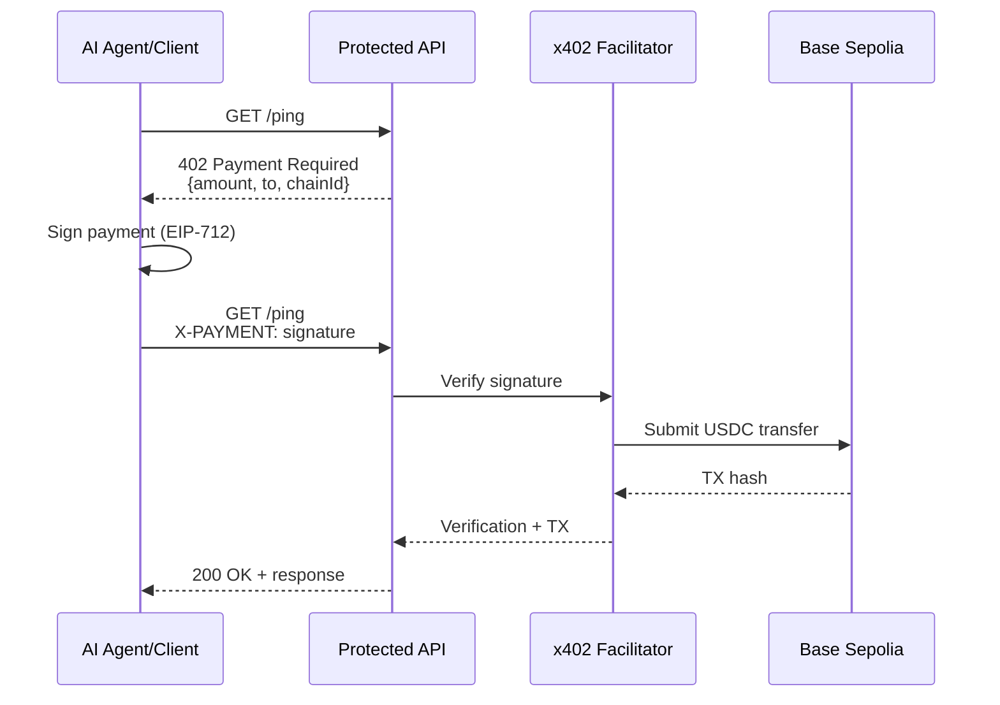

## Overview

The x402 protocol makes the HTTP `402 Payment Required` status code finally useful after 30+ years. Reserved since HTTP/1.1 in 1997, it now enables autonomous payment flows for AI agents and APIs.

**Key insight:** Payments become just another HTTP status code—like `401 Unauthorized` but for money.

## How It Works

The x402 protocol transforms payment requirements into standard HTTP exchanges:

<Steps>
  <Step title="Request Protected Resource">
    Client makes a request to a paid endpoint without payment
    
    ```bash
    curl -i http://localhost:3000/ping
    ```
  </Step>
  
  <Step title="Server Returns 402">
    Server responds with payment requirements in the response body
    
    ```http
    HTTP/1.1 402 Payment Required
    Content-Type: application/json
    
    {
      "payment": {
        "amount": "1000",
        "currency": "USDC",
        "to": "0x742d35Cc6634C0532925a3b844Bc9e7595f0bEb",
        "chainId": 84532,
        "network": "base-sepolia",
        "facilitator": "https://x402.org/facilitator"
      }
    }
    ```
  </Step>
  
  <Step title="Client Signs Payment">
    Client creates cryptographic signature using EIP-712 typed data
    
    ```typescript
    const signature = await wallet.signTypedData({
      domain: {
        name: "x402 Payment",
        version: "1",
        chainId: 84532
      },
      types: {
        Payment: [
          { name: "amount", type: "uint256" },
          { name: "currency", type: "address" },
          { name: "to", type: "address" },
          { name: "nonce", type: "uint256" }
        ]
      },
      primaryType: "Payment",
      message: {
        amount: "1000",
        currency: "0x036CbD53842c5426634e7929541eC2318f3dCF7e",
        to: "0x742d35Cc6634C0532925a3b844Bc9e7595f0bEb",
        nonce: Date.now()
      }
    });
    ```
  </Step>
  
  <Step title="Retry with Payment Header">
    Client retries the request with the `X-PAYMENT` header containing the signature
    
    ```bash
    curl -i \
      -H "X-PAYMENT: 0x1234...abcd" \
      http://localhost:3000/ping
    ```
  </Step>
  
  <Step title="Server Verifies & Settles">
    Server verifies the signature and settles the payment on-chain
    
    ```http
    HTTP/1.1 200 OK
    Content-Type: application/json
    X-Transaction-Hash: 0xabc...def
    
    {
      "message": "pong",
      "transactionHash": "0xabc...def"
    }
    ```
  </Step>
</Steps>

## Payment Flow Diagram



## Basic Implementation

### Server-Side (Express)

The simplest x402 server uses the `x402-express` middleware:

```typescript server.ts
import express from "express";
import { paymentMiddleware } from "x402-express";

const app = express();
const payTo = "0x742d35Cc6634C0532925a3b844Bc9e7595f0bEb";

// Configure payment requirements
app.use(paymentMiddleware(payTo, {
  "GET /ping": { price: "$0.001", network: "base-sepolia" }
}));

// Protected endpoint
app.get("/ping", (_req, res) => {
  res.json({ message: "pong" });
});

app.listen(3000);
```

See [ping/src/server.ts:1-22](https://github.com/crossmint/crossmint-agentic-finance/blob/main/ping/src/server.ts)

### Client-Side

Clients can handle 402 responses automatically:

```typescript
import { createX402Client } from "x402-client";

const client = createX402Client({
  wallet: crossmintWallet,
  onPaymentRequired: async (requirement, retryFn) => {
    // 1. Show payment confirmation to user
    const approved = await confirmPayment(requirement);
    if (!approved) throw new Error("Payment declined");
    
    // 2. Sign payment
    const signature = await wallet.signPayment(requirement);
    
    // 3. Retry with signature
    return retryFn(signature);
  }
});

// Make request - automatically handles 402
const response = await client.get("http://localhost:3000/ping");
```

## Payment Requirements Format

The `402` response must include a `payment` object:

<ParamField path="payment.amount" type="string" required>
  Amount in token's smallest unit (e.g., 6 decimals for USDC)
  
  Example: `"1000"` = 0.001 USDC
</ParamField>

<ParamField path="payment.currency" type="string" required>
  Token identifier (symbol or contract address)
  
  Example: `"USDC"` or `"0x036CbD53842c5426634e7929541eC2318f3dCF7e"`
</ParamField>

<ParamField path="payment.to" type="string" required>
  Recipient wallet address
  
  Example: `"0x742d35Cc6634C0532925a3b844Bc9e7595f0bEb"`
</ParamField>

<ParamField path="payment.chainId" type="number" required>
  EVM chain ID
  
  Example: `84532` (Base Sepolia), `8453` (Base Mainnet)
</ParamField>

<ParamField path="payment.network" type="string">
  Human-readable network name
  
  Example: `"base-sepolia"`, `"base"`
</ParamField>

<ParamField path="payment.facilitator" type="string">
  URL of the x402 facilitator service
  
  Example: `"https://x402.org/facilitator"`
</ParamField>

## The Facilitator

The facilitator is a critical component that handles blockchain interactions:

### Responsibilities

<CardGroup cols={2}>
  <Card title="Signature Verification" icon="signature">
    Validates that signatures match the payment message and signer
  </Card>
  <Card title="Balance Checking" icon="wallet">
    Ensures the payer has sufficient USDC balance
  </Card>
  <Card title="Transaction Submission" icon="paper-plane">
    Submits USDC transfer transactions to the blockchain
  </Card>
  <Card title="Settlement Tracking" icon="receipt">
    Returns transaction hashes for verification
  </Card>
</CardGroup>

### Facilitator API

The facilitator exposes a simple verification endpoint:

```typescript
POST /verify
Content-Type: application/json

{
  "signature": "0x1234...abcd",
  "message": {
    "amount": "1000",
    "currency": "0x036CbD53842c5426634e7929541eC2318f3dCF7e",
    "to": "0x742d35Cc6634C0532925a3b844Bc9e7595f0bEb",
    "nonce": 1234567890
  },
  "signer": "0xGuestWalletAddress"
}
```

Response:

```json
{
  "verified": true,
  "txHash": "0xabc...def",
  "blockNumber": 12345678
}
```

<Warning>
  **Production deployments** should run their own facilitator or use a decentralized alternative. The public facilitator at `https://x402.org/facilitator` is for testing only.
</Warning>

## EIP-712 Typed Data

The x402 protocol uses EIP-712 for human-readable signatures. Users see exactly what they're signing:

```typescript
{
  domain: {
    name: "x402 Payment",
    version: "1",
    chainId: 84532,
    verifyingContract: "0x036CbD53842c5426634e7929541eC2318f3dCF7e"
  },
  types: {
    Payment: [
      { name: "amount", type: "uint256" },
      { name: "currency", type: "address" },
      { name: "to", type: "address" },
      { name: "nonce", type: "uint256" }
    ]
  },
  primaryType: "Payment",
  message: {
    amount: "1000",      // 0.001 USDC
    currency: "0x036CbD53842c5426634e7929541eC2318f3dCF7e",
    to: "0x742d35Cc6634C0532925a3b844Bc9e7595f0bEb",
    nonce: 1234567890
  }
}
```

In MetaMask or WalletConnect, this appears as:

```
Pay 0.001 USDC to 0x742d...0bEb
```

Much better than signing a random hex string!

## Advantages

<AccordionGroup>
  <Accordion title="No Custom Protocols" icon="plug">
    Uses standard HTTP status codes and headers. No WebSockets, no polling, no custom RPC.
  </Accordion>
  
  <Accordion title="Framework Agnostic" icon="layer-group">
    Works with any HTTP server (Express, FastAPI, Cloudflare Workers, etc.)
  </Accordion>
  
  <Accordion title="Agent Friendly" icon="robot">
    AI agents can handle 402 responses just like 401 auth challenges
  </Accordion>
  
  <Accordion title="Cryptographically Secure" icon="shield">
    EIP-712 signatures prevent replay attacks and ensure non-repudiation
  </Accordion>
  
  <Accordion title="Blockchain Agnostic" icon="link">
    Currently supports EVM chains, but protocol design allows for Solana, Bitcoin, etc.
  </Accordion>
</AccordionGroup>

## Real-World Examples

<CardGroup cols={2}>
  <Card title="Ping" icon="signal" href="https://github.com/crossmint/crossmint-agentic-finance/tree/main/ping">
    Minimal x402 server - perfect starting point
  </Card>
  <Card title="Weather API" icon="cloud" href="https://github.com/crossmint/crossmint-agentic-finance/tree/main/weather">
    Paid weather data with city parameter
  </Card>
  <Card title="Tweet Agent" icon="twitter" href="https://github.com/crossmint/crossmint-agentic-finance/tree/main/send-tweet">
    Pay to post tweets via agent
  </Card>
  <Card title="Event RSVP" icon="calendar" href="https://github.com/crossmint/crossmint-agentic-finance/tree/main/events-concierge">
    MCP-based event booking with payments
  </Card>
</CardGroup>

## Next Steps

<CardGroup cols={2}>
  <Card title="A2A Payments" icon="arrows-turn-to-dots" href="/concepts/a2a-payments">
    Learn about agent-to-agent payment patterns
  </Card>
  <Card title="Smart Wallets" icon="wallet" href="/concepts/smart-wallets">
    Understand Crossmint smart wallet integration
  </Card>
  <Card title="Payment Flow" icon="diagram-project" href="/concepts/payment-flow">
    Deep dive into end-to-end payment flows
  </Card>
  <Card title="Quickstart" icon="rocket" href="/quickstart">
    Build your first x402 server
  </Card>
</CardGroup>

## Resources

- [x402 Protocol Specification](https://x402.org)
- [HTTP 402 Payment Required](https://developer.mozilla.org/en-US/docs/Web/HTTP/Status/402)
- [EIP-712: Typed Structured Data](https://eips.ethereum.org/EIPS/eip-712)
- [x402-express NPM Package](https://www.npmjs.com/package/x402-express)
