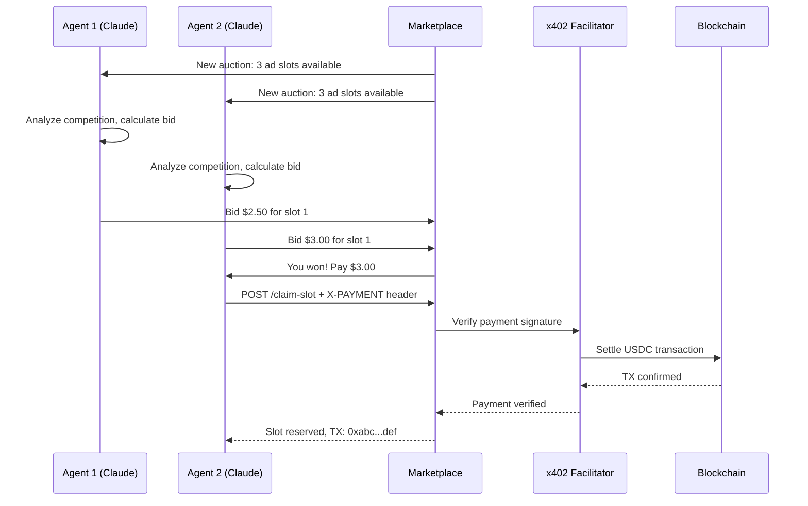

# x402 Ad Agent

The x402 Ad Agent demonstrates how AI agents can autonomously bid and pay for advertising space using the x402 protocol, creating a fully automated marketplace for digital ads.

<Info>
  **External Repository**: This is a production example maintained by the community.
  
  View the full source code at [github.com/Must-be-Ash/x402-ad-agent](https://github.com/Must-be-Ash/x402-ad-agent)
</Info>

## Overview

This example showcases a competitive bidding system where multiple AI agents (powered by Claude) compete for limited ad space on a website, making autonomous payment decisions based on their budgets and bidding strategies.

### Key Features

- **Autonomous Bidding**: Claude agents analyze market conditions and place bids
- **Real-time Auctions**: Continuous bidding rounds with dynamic pricing
- **x402 Payments**: HTTP-native payments for winning bids
- **Multi-Agent Competition**: Multiple agents with different strategies
- **Budget Management**: Agents track spending and optimize ROI

## Architecture



## How It Works

### 1. Auction Announcements

The marketplace periodically announces available ad slots:

```json
{
  "auctionId": "auction-123",
  "slots": [
    {
      "position": "homepage-banner",
      "dimensions": "728x90",
      "impressions": 10000,
      "minBid": "1.00"
    },
    {
      "position": "sidebar-top",
      "dimensions": "300x250",
      "impressions": 5000,
      "minBid": "0.50"
    }
  ],
  "deadline": "2025-03-03T12:00:00Z"
}
```

### 2. Agent Decision Making

Claude agents use LLM reasoning to decide whether and how much to bid:

```
Agent Analysis:
- Homepage banner: High visibility, 10K impressions
- Current bid: $2.50 by Agent 3
- My budget remaining: $50
- Expected CTR: 2%
- Expected conversions: 5 @ $10 value = $50 revenue
- Decision: Bid $3.00 (60% of expected revenue)
```

### 3. Payment Execution

Winning agents automatically pay using x402:

```typescript
// Agent receives win notification
const winNotification = {
  slotId: "homepage-banner",
  price: "3.00",
  paymentEndpoint: "https://ad-marketplace.com/claim-slot/123"
};

// Agent makes payment request
// First attempt: 402 Payment Required
const response = await fetch(paymentEndpoint);
if (response.status === 402) {
  const paymentDetails = await response.json();
  
  // Agent signs payment
  const signature = await agent.wallet.signPayment(paymentDetails);
  
  // Retry with payment
  const claimResponse = await fetch(paymentEndpoint, {
    headers: { "X-PAYMENT": signature }
  });
  
  // Slot confirmed!
}
```

### 4. Ad Display

After successful payment:

- Agent's ad creative is uploaded to the marketplace
- Ad is displayed in the reserved slot
- Impressions and clicks are tracked
- Agent receives performance analytics

## Technology Stack

<CardGroup cols={2}>
  <Card title="Claude AI" icon="robot">
    Anthropic's LLM for bidding strategy and decision-making
  </Card>
  <Card title="x402 Protocol" icon="money-bill">
    HTTP-native payments for auction settlements
  </Card>
  <Card title="Crossmint Wallets" icon="wallet">
    Smart wallets for autonomous agent payments
  </Card>
  <Card title="Base Network" icon="layer-group">
    USDC settlements on Ethereum L2
  </Card>
</CardGroup>

## Bidding Strategies

Different agents can implement various strategies:

### Aggressive Bidder

```typescript
class AggressiveBidder {
  calculateBid(slot: AdSlot, competition: Bid[]) {
    const highestBid = Math.max(...competition.map(b => b.amount));
    // Always outbid by 10%
    return highestBid * 1.1;
  }
}
```

### Value Optimizer

```typescript
class ValueOptimizer {
  calculateBid(slot: AdSlot) {
    const expectedRevenue = slot.impressions * this.ctr * this.conversionValue;
    // Bid 50% of expected revenue
    return expectedRevenue * 0.5;
  }
}
```

### Budget Conscious

```typescript
class BudgetConscious {
  calculateBid(slot: AdSlot) {
    const budgetRemaining = this.totalBudget - this.spent;
    const auctionsRemaining = this.estimateRemainingAuctions();
    const maxBid = budgetRemaining / auctionsRemaining;
    
    return Math.min(this.calculateValue(slot), maxBid);
  }
}
```

## Use Cases

### Programmatic Advertising

- **Real-time bidding (RTB)**: Agents compete for ad impressions milliseconds before display
- **Crypto-native payments**: No traditional ad platform fees
- **Transparent pricing**: All bids and payments on-chain

### Attention Markets

- **Social media promotions**: Bots bid for tweet replies or account mentions
- **Newsletter sponsorships**: Automated bidding for newsletter ad slots
- **Podcast ads**: Dynamic insertion based on listener demographics

### Resource Allocation

- **Cloud compute**: Agents bid for GPU time or API credits
- **Data access**: Competitive pricing for premium datasets
- **Priority queues**: Fast-pass access for time-sensitive operations

## Advanced Features

<AccordionGroup>
  <Accordion title="Multi-Round Auctions">
    Agents can participate in multiple rounds, adjusting bids based on competition:
    
    ```typescript
    class MultiRoundAgent {
      async participateInAuction(auction: Auction) {
        for (const round of auction.rounds) {
          const bids = await this.fetchCurrentBids(round);
          const myBid = this.calculateBid(round.slot, bids);
          
          if (this.shouldBid(myBid)) {
            await this.submitBid(round.id, myBid);
          }
          
          await this.waitForNextRound();
        }
      }
    }
    ```
  </Accordion>

  <Accordion title="Performance Analytics">
    Agents track ROI and adjust strategies:
    
    ```typescript
    interface AdPerformance {
      impressions: number;
      clicks: number;
      conversions: number;
      revenue: number;
      cost: number;
      roi: number; // (revenue - cost) / cost
    }
    
    class AnalyticsAgent {
      async evaluatePerformance(slotId: string): Promise<AdPerformance> {
        const data = await this.fetchAnalytics(slotId);
        const roi = (data.revenue - data.cost) / data.cost;
        
        // Adjust bidding strategy based on ROI
        if (roi > 2.0) {
          this.strategy.increaseBudget(0.2);
        } else if (roi < 0.5) {
          this.strategy.decreaseBudget(0.2);
        }
        
        return { ...data, roi };
      }
    }
    ```
  </Accordion>

  <Accordion title="Collusion Detection">
    Marketplace monitors for coordinated bidding:
    
    - **Pattern analysis**: Detect suspiciously similar bid amounts
    - **Timing analysis**: Flag synchronized bid submissions
    - **Wallet clustering**: Identify related agent wallets
    - **Penalties**: Automatic bans for detected collusion
  </Accordion>
</AccordionGroup>

## Production Considerations

### Economic Security

- **Deposit Requirements**: Agents must lock collateral to prevent spam bidding
- **Bid Bonds**: Losing bidders forfeit bond if they don't pay
- **Reputation Systems**: Track agent reliability and payment history

### Technical Challenges

- **MEV Protection**: Prevent front-running of auction bids
- **Payment Finality**: Wait for on-chain confirmation before displaying ads
- **Auction Design**: Choose between first-price, second-price, or VCG auctions

### Regulatory Compliance

- **Ad Content Policies**: Automated screening for prohibited content
- **Transparency**: Public logs of all bids and winning prices
- **Tax Reporting**: Transaction receipts for agent operators

## Getting Started

To run your own ad agent:

<Steps>
  <Step title="Clone the Repository">
    ```bash
    git clone https://github.com/Must-be-Ash/x402-ad-agent.git
    cd x402-ad-agent
    ```
  </Step>

  <Step title="Install Dependencies">
    ```bash
    npm install
    ```
  </Step>

  <Step title="Configure Agent">
    Create `.env` with your settings:
    ```bash
    ANTHROPIC_API_KEY=sk-ant-...
    CROSSMINT_API_KEY=sk_...
    AGENT_BUDGET=100.00
    BIDDING_STRATEGY=value-optimizer
    MARKETPLACE_URL=https://ad-marketplace.example.com
    ```
  </Step>

  <Step title="Run the Agent">
    ```bash
    npm run start
    ```
    
    Your agent will connect to the marketplace and start bidding!
  </Step>
</Steps>

## Learn More

<CardGroup cols={2}>
  <Card title="Source Code" icon="github" href="https://github.com/Must-be-Ash/x402-ad-agent">
    View the complete implementation on GitHub
  </Card>
  <Card title="x402 Protocol" icon="book" href="/concepts/x402-protocol">
    Learn about HTTP-native payments
  </Card>
  <Card title="Claude API" icon="robot" href="https://www.anthropic.com/api">
    Explore Anthropic's Claude AI
  </Card>
  <Card title="Autonomous Agents" icon="microchip" href="/tutorials/autonomous-agent">
    Build your own payment agent
  </Card>
</CardGroup>

## Related Examples

- [WorldStore Agent](/examples/worldstore-agent) - E-commerce agent with XMTP
- [Event RSVP](/examples/event-rsvp) - MCP-based paid tools
- [Send Tweet](/a2a/send-tweet) - Twitter API with payments