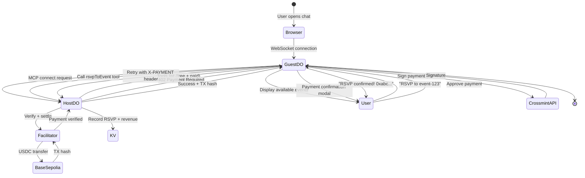

# Event RSVP (Events Concierge)

A production-ready reference implementation showing how AI agents can autonomously pay for MCP tool calls using smart wallets, Cloudflare Durable Objects, and the x402 payment protocol.

<Info>
  This is the most comprehensive production example in the repository, demonstrating advanced patterns for multi-tenant agent systems with real on-chain payments.
</Info>

## Overview

The Events Concierge enables users to create paid events and allows AI agents to autonomously RSVP by making USDC payments on Base Sepolia. Unlike simpler demos, this implements:

- **Per-user isolation** using Cloudflare Durable Objects
- **Multi-tenant architecture** with separate wallets per host
- **Production-grade payment verification** with ERC-6492 and EIP-1271
- **Stateful agent connections** maintained across requests
- **Real blockchain settlements** on Base Sepolia

### What Makes This Different

<CardGroup cols={2}>
  <Card title="Real Payments" icon="dollar-sign">
    Actual on-chain USDC transactions on Base—no mocks, no simulations
  </Card>
  <Card title="Multi-Tenant" icon="users">
    Each user gets their own MCP server instance with isolated wallet and data
  </Card>
  <Card title="Stateful Agents" icon="database">
    Durable Objects maintain connection state, eliminating race conditions
  </Card>
  <Card title="Production Patterns" icon="shield">
    Error handling, retry logic, signature verification, and deployment strategies
  </Card>
</CardGroup>

## Architecture



## Core Technologies

### 1. Cloudflare Durable Objects

Durable Objects provide **single-threaded, stateful mini-servers** per user:

<CodeGroup>
```typescript Host Agent (Per-User Instance)
export class Host extends DurableObject {
  private wallet: Wallet;
  private server: McpServer;
  private userScopeId: string;

  constructor(ctx: DurableObjectState, env: Env) {
    super(ctx, env);
    
    // Extract user ID from DO name
    const headers = new Headers(request.headers);
    this.userScopeId = headers.get("x-user-scope-id");
    
    // Each user gets their own wallet
    this.wallet = await createHostWallet(env, this.userScopeId);
    
    // Each user gets their own MCP server
    this.server = new McpServer({ name: `Events-${this.userScopeId}` })
      .withX402({ wallet: this.wallet, ... });
  }
}
```

```typescript Guest Agent (Shared Instance)
export class Guest extends DurableObject {
  private wallet: Wallet;
  private mcpClient?: McpClient;
  private confirmations: Map<string, Promise<boolean>>;

  async onMessage(conn: Connection, message: WSMessage) {
    const parsed = JSON.parse(message);
    
    if (parsed.type === "connect_mcp") {
      // Connect to host's MCP server
      this.mcpClient = await this.mcp.connect(parsed.url);
      this.x402Client = withX402Client(this.mcpClient, {
        account: createX402Signer(this.wallet)
      });
    }
    
    if (parsed.type === "call_tool") {
      // Automatically handles 402 responses
      const result = await this.x402Client.callTool(
        this.onPaymentRequired.bind(this),
        { name: parsed.tool, arguments: parsed.arguments }
      );
    }
  }
}
```
</CodeGroup>

**Why Durable Objects?**

| Need | Regular Worker | Durable Object |
|------|---------------|----------------|
| MCP connection state | Lost between requests | Persists in memory |
| WebSocket support | Limited | Built-in |
| Per-user isolation | Shared instance | Unique per ID |
| Coordination | Race conditions | Single-threaded |

### 2. MCP with x402 Payments

MCP (Model Context Protocol) allows agents to call tools. x402 adds payment requirements:

<CodeGroup>
```typescript Define Paid Tools
// Host defines what tools require payment
this.server.paidTool(
  "rsvpToEvent",
  "RSVP to a paid event",
  0.05,  // Price in USD
  { eventId: z.string() },
  {},
  async ({ eventId }, paymentTx: TransactionReceipt) => {
    // Only executed AFTER payment verification!
    
    const event = await eventService.getEvent(eventId);
    await eventService.recordRsvp({
      eventId,
      guestWallet: paymentTx.from,
      txHash: paymentTx.hash,
      amount: "50000" // 0.05 USDC (6 decimals)
    });
    
    return {
      success: true,
      event,
      transactionHash: paymentTx.hash
    };
  }
);
```

```typescript Auto-Pay on 402
// Guest automatically handles payment requests
const x402Client = withX402Client(mcpClient, {
  network: "base-sepolia",
  account: x402Signer
});

async function onPaymentRequired(requirements: PaymentRequirements[]) {
  // 1. Show user confirmation modal
  const confirmed = await askUser(requirements);
  if (!confirmed) return false;
  
  // 2. Sign payment with Crossmint wallet
  const signature = await wallet.signPayment(requirements[0]);
  
  // 3. Return true to retry with signature
  return true;
}

// Call tool - automatically handles 402!
const result = await x402Client.callTool(
  onPaymentRequired,
  { name: "rsvpToEvent", arguments: { eventId: "abc-123" } }
);
```
</CodeGroup>

### 3. Crossmint Smart Wallets

Crossmint wallets work **before** deployment using ERC-6492 signatures:

```typescript
// Create wallet (not deployed yet!)
const wallet = await crossmintWallets.createWallet({
  chain: "base-sepolia",
  signer: { type: "api-key" }
});

console.log(wallet.address); // 0x123... (counterfactual address)

// Can sign payments before deployment
const signature = await wallet.signTypedData({
  domain: { chainId: 84532, ... },
  types: { Payment: [...] },
  message: { amount: "50000", to: "0xabc...", ... }
});
// Returns ERC-6492 signature (includes deployment bytecode)

// First payment auto-deploys the wallet
const tx = await facilitator.settle(signature);
// Wallet is now deployed and owns itself!
```

**Signature Standards:**

| Stage | Standard | How It Works |
|-------|----------|-------------|
| Pre-deployed | ERC-6492 | Signature includes deployment bytecode. Verifier simulates deployment. |
| Deployed | EIP-1271 | Contract's `isValidSignature()` validates signatures. |

### 4. Per-User Data Isolation

KV storage is scoped by user ID:

```typescript
// User registration creates URL-safe hash
const urlSafeId = await hashUserId(email); // "a3f2c1b4..."

// Store user mapping
await env.SECRETS.put(`users:${email}`, JSON.stringify({
  userId: email,
  walletAddress: wallet.address,
  urlSafeId
}));

await env.SECRETS.put(`usersByHash:${urlSafeId}`, ...);

// Events scoped by urlSafeId
await env.SECRETS.put(
  `${urlSafeId}:events:${eventId}`,
  JSON.stringify(eventData)
);

// Revenue tracking
await env.SECRETS.put(
  `${urlSafeId}:revenue`,
  totalRevenue.toString()
);
```

**Routing:**

```
User A → /mcp/users/a3f2c1b4 → Host DO (name: "a3f2c1b4")
                                 ├─ wallet: 0xAAA...
                                 ├─ events: [event1, event2]
                                 └─ revenue: $12.50

User B → /mcp/users/b8e9d6f1 → Host DO (name: "b8e9d6f1")
                                 ├─ wallet: 0xBBB...
                                 ├─ events: [event3]
                                 └─ revenue: $3.00
```

## Payment Flow Deep Dive

<Steps>
  <Step title="Guest Calls Paid Tool">
    ```typescript
    await x402Client.callTool(onPaymentRequired, {
      name: "rsvpToEvent",
      arguments: { eventId: "event-123" }
    });
    ```
  </Step>

  <Step title="Host Returns 402">
    ```json
    {
      "statusCode": 402,
      "payment": {
        "amount": "50000",
        "currency": "USDC",
        "to": "0xHostWallet...",
        "chainId": 84532,
        "facilitator": "https://x402.org/facilitator"
      }
    }
    ```
  </Step>

  <Step title="Guest Confirms Payment">
    User sees modal with payment details and clicks "Approve".
  </Step>

  <Step title="Guest Signs EIP-712">
    ```typescript
    const signature = await wallet.signTypedData({
      domain: { name: "x402 Payment", version: "1", chainId: 84532 },
      types: {
        Payment: [
          { name: "amount", type: "uint256" },
          { name: "currency", type: "address" },
          { name: "to", type: "address" }
        ]
      },
      message: {
        amount: "50000",
        currency: "0x036CbD53842c5426634e7929541eC2318f3dCF7e",
        to: "0xHostWallet..."
      }
    });
    ```
  </Step>

  <Step title="Guest Retries with Signature">
    ```typescript
    await x402Client.callTool(onPaymentRequired, {
      name: "rsvpToEvent",
      arguments: { eventId: "event-123" }
    }, {
      headers: { "X-PAYMENT": signature }
    });
    ```
  </Step>

  <Step title="Facilitator Verifies + Settles">
    - Verify signature matches message
    - Check guest has USDC balance
    - Submit `transferFrom` transaction
    - Return TX hash
  </Step>

  <Step title="Host Records RSVP">
    ```typescript
    await eventService.recordRsvp({
      eventId: "event-123",
      guestWallet: "0xGuestWallet...",
      txHash: "0xabc...def",
      amount: "50000"
    });
    
    await incrementRevenue("50000");
    ```
  </Step>

  <Step title="Guest Receives Confirmation">
    ```json
    {
      "success": true,
      "event": { "id": "event-123", "title": "Web3 Meetup" },
      "transactionHash": "0xabc...def",
      "message": "RSVP confirmed! Paid 0.05 USDC."
    }
    ```
  </Step>
</Steps>

## Key Features

### Free Tools

```typescript
// List events (no payment required)
this.server.tool(
  "listEvents",
  "List all available events",
  {},
  {},
  async () => {
    const events = await eventService.listEvents();
    return { events };
  }
);
```

### Paid Tools

```typescript
// RSVP requires $0.05 payment
this.server.paidTool(
  "rsvpToEvent",
  "RSVP to an event",
  0.05,
  { eventId: z.string() },
  {},
  async ({ eventId }, tx) => {
    // Payment already verified!
    await recordRsvp(eventId, tx);
  }
);
```

### Analytics Tool

```typescript
// Get event stats for $0.01
this.server.paidTool(
  "getEventAnalytics",
  "Get detailed event analytics",
  0.01,
  { eventId: z.string() },
  {},
  async ({ eventId }) => {
    const rsvps = await getRsvps(eventId);
    return {
      totalRsvps: rsvps.length,
      totalRevenue: rsvps.reduce((sum, r) => sum + parseFloat(r.amount), 0),
      rsvps
    };
  }
);
```

## Production Deployment

<Steps>
  <Step title="Create KV Namespace">
    ```bash
    npx wrangler kv:namespace create "SECRETS"
    # Copy the ID to wrangler.toml
    ```
  </Step>

  <Step title="Set Secrets">
    ```bash
    npx wrangler secret put OPENAI_API_KEY
    npx wrangler secret put CROSSMINT_API_KEY
    ```
  </Step>

  <Step title="Configure Durable Objects">
    ```toml
    # wrangler.toml
    [[durable_objects.bindings]]
    name = "Host"
    class_name = "Host"
    script_name = "events-concierge"

    [[durable_objects.bindings]]
    name = "Guest"
    class_name = "Guest"
    script_name = "events-concierge"
    ```
  </Step>

  <Step title="Deploy">
    ```bash
    npm run deploy
    # App live at https://events-concierge.YOUR-SUBDOMAIN.workers.dev
    ```
  </Step>

  <Step title="Switch to Mainnet">
    Update `src/constants.ts`:
    ```typescript
    export const CHAIN_ID = 8453; // Base mainnet
    export const NETWORK = "base";
    export const USDC_ADDRESS = "0x833589fCD6eDb6E08f4c7C32D4f71b54bdA02913";
    ```
    
    Redeploy:
    ```bash
    npm run deploy
    ```
  </Step>
</Steps>

## Use Cases

<CardGroup cols={2}>
  <Card title="Paid API Access" icon="key">
    Monetize MCP tools without subscription models. Pay-per-use for data, AI inference, or compute.
  </Card>
  <Card title="Event Ticketing" icon="ticket">
    Sell event tickets through AI agents. Automated RSVP management with on-chain receipts.
  </Card>
  <Card title="Premium Features" icon="star">
    Unlock advanced agent capabilities with micropayments. Free tier + paid upgrades.
  </Card>
  <Card title="Agent Marketplaces" icon="store">
    Build platforms where agents discover and pay for third-party tools autonomously.
  </Card>
</CardGroup>

## Learn More

<CardGroup cols={2}>
  <Card title="Source Code" icon="github" href="https://github.com/Crossmint/crossmint-agentic-finance/tree/main/events-concierge">
    View the complete implementation
  </Card>
  <Card title="Durable Objects" icon="book" href="/tutorials/durable-objects">
    Learn about stateful agent architecture
  </Card>
  <Card title="MCP Protocol" icon="plug" href="https://modelcontextprotocol.io">
    Explore the Model Context Protocol
  </Card>
  <Card title="x402 Spec" icon="money-bill" href="/concepts/x402-protocol">
    Understand HTTP payment protocol
  </Card>
</CardGroup>

## Related Examples

- [WorldStore Agent](/examples/worldstore-agent) - XMTP-based e-commerce
- [Ad Agent](/examples/ad-agent) - Autonomous bidding system
- [Cloudflare Agents](/a2a/cloudflare-agents) - Agent-to-agent on the edge