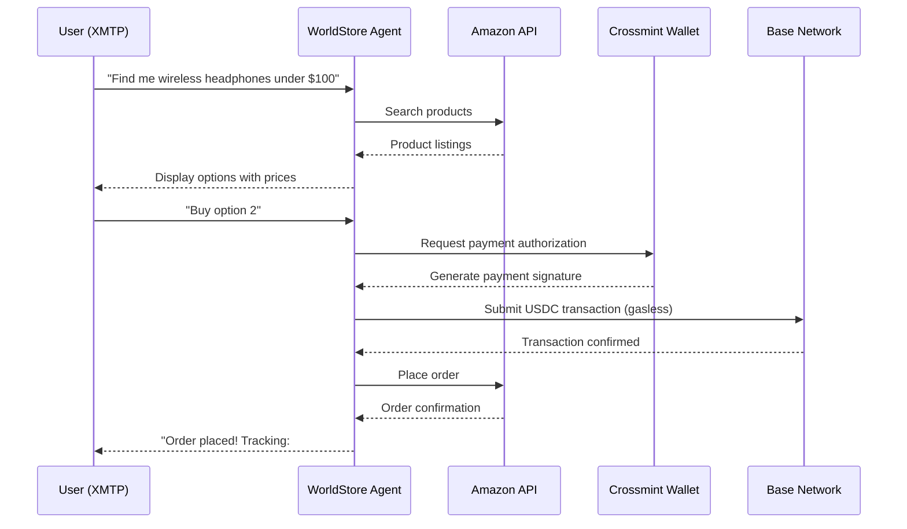

# WorldStore Agent

The WorldStore Agent is a production XMTP-based AI agent that enables users to purchase Amazon products through natural language chat, powered by autonomous USDC payments on Base.

<Info>
  **External Repository**: This is a production example maintained in a separate repository.
  
  View the full source code at [github.com/crossmint/worldstore-agent](https://github.com/crossmint/worldstore-agent)
</Info>

## Overview

WorldStore demonstrates how AI agents can bridge traditional e-commerce with blockchain payments, providing a seamless chat-based shopping experience.

### Key Features

- **XMTP Integration**: Real-time messaging protocol for AI-to-human communication
- **Amazon Product Search**: Natural language queries for product discovery
- **Gasless Payments**: Users pay with USDC without worrying about gas fees
- **Base Network**: Fast, low-cost transactions on Ethereum L2
- **Smart Wallet Integration**: Crossmint wallets for secure, keyless transactions

## Architecture



## How It Works

### 1. Chat-Based Discovery

Users interact with the agent via XMTP messaging:

```
User: Show me the best gaming keyboards
Agent: Here are 3 top-rated options:
1. Razer BlackWidow V3 - $89.99
2. Corsair K95 RGB - $129.99
3. Logitech G Pro - $99.99
```

### 2. Autonomous Payment Processing

When a user decides to purchase:

- Agent generates a payment request with the product price in USDC
- User's Crossmint wallet signs the transaction
- Payment is submitted to Base network with sponsored gas
- No manual wallet interaction required

### 3. Order Fulfillment

After payment confirmation:

- Agent places the order through Amazon's API
- Order tracking is automatically shared with the user
- Transaction receipt includes on-chain TX hash

## Technology Stack

<CardGroup cols={2}>
  <Card title="XMTP" icon="message">
    Decentralized messaging protocol for agent communication
  </Card>
  <Card title="Crossmint Wallets" icon="wallet">
    Smart wallets with gasless transaction support
  </Card>
  <Card title="Base Network" icon="layer-group">
    Ethereum L2 for fast, cheap USDC settlements
  </Card>
  <Card title="Amazon MWS API" icon="cart-shopping">
    Product search and order placement
  </Card>
</CardGroup>

## Use Cases

### E-Commerce Agents

- Shopping assistants that understand natural language
- Price comparison across multiple retailers
- Automated reordering based on user preferences

### Subscription Services

- Recurring purchases managed by AI
- Smart budgeting and recommendation engines
- Crypto-native payment rails for global commerce

### Group Buying

- Coordinated purchases through group chats
- Split payments using smart contracts
- Automated fulfillment and distribution

## Key Insights

<AccordionGroup>
  <Accordion title="Why XMTP?">
    XMTP provides a decentralized, censorship-resistant messaging layer that's perfect for AI agents. Unlike traditional chat APIs:
    
    - Messages are end-to-end encrypted
    - No platform can de-platform the agent
    - Users control their conversation history
    - Interoperable with other XMTP clients
  </Accordion>

  <Accordion title="Why Gasless Transactions?">
    User experience is critical for adoption. Gasless transactions mean:
    
    - Users only see the product price, not gas fees
    - No need to acquire ETH for transactions
    - Crossmint sponsors gas on behalf of users
    - Simplified onboarding for non-crypto natives
  </Accordion>

  <Accordion title="Why Base Network?">
    Base offers the best balance for commerce applications:
    
    - **Low fees**: Transactions cost fractions of a cent
    - **Fast finality**: 2-second block times
    - **USDC native**: Circle's official USDC deployment
    - **Ethereum security**: Inherits Ethereum's security model
  </Accordion>
</AccordionGroup>

## Production Considerations

### Security

- **Payment Verification**: All USDC payments are verified on-chain before order placement
- **Wallet Custody**: Users maintain full control of their Crossmint wallets
- **Rate Limiting**: Prevents abuse and spam through XMTP rate limits

### Scalability

- **Async Processing**: Orders are queued and processed asynchronously
- **Caching**: Product data cached to reduce API calls
- **Database**: Persistent storage for order history and user preferences

### Compliance

- **KYC/AML**: Integration with Crossmint's compliance tools
- **Tax Reporting**: Transaction receipts for user tax obligations
- **Privacy**: XMTP encryption ensures message privacy

## Getting Started

To explore or deploy your own instance:

<Steps>
  <Step title="Clone the Repository">
    ```bash
    git clone https://github.com/crossmint/worldstore-agent.git
    cd worldstore-agent
    ```
  </Step>

  <Step title="Install Dependencies">
    ```bash
    npm install
    ```
  </Step>

  <Step title="Configure Environment">
    Create `.env` with required keys:
    ```bash
    CROSSMINT_API_KEY=sk_...
    AMAZON_ACCESS_KEY=...
    XMTP_PRIVATE_KEY=...
    BASE_RPC_URL=https://mainnet.base.org
    ```
  </Step>

  <Step title="Run the Agent">
    ```bash
    npm run start
    ```
  </Step>
</Steps>

## Learn More

<CardGroup cols={2}>
  <Card title="Source Code" icon="github" href="https://github.com/crossmint/worldstore-agent">
    View the complete implementation on GitHub
  </Card>
  <Card title="XMTP Documentation" icon="book" href="https://xmtp.org/docs">
    Learn about the XMTP messaging protocol
  </Card>
  <Card title="Crossmint Wallets" icon="wallet" href="/concepts/smart-wallets">
    Understand smart wallet integration
  </Card>
  <Card title="Base Network" icon="layer-group" href="https://base.org">
    Explore the Base L2 network
  </Card>
</CardGroup>

## Related Examples

- [Ad Agent](/examples/ad-agent) - Autonomous bidding system for ad space
- [Event RSVP](/examples/event-rsvp) - MCP-based event management
- [Send Tweet](/a2a/send-tweet) - Twitter posting with payments