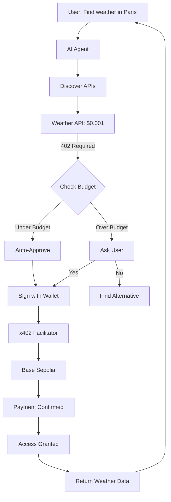

# Build an Autonomous Payment Agent

Learn how to create an AI agent that can autonomously discover paid services, make payment decisions, and execute USDC transactions—all without manual intervention.

<Info>
  **Time to complete**: 30-40 minutes
  
  **What you'll build**: A Claude-powered agent that browses the web, finds paid APIs, and autonomously pays to access them
</Info>

## Prerequisites

<CardGroup cols={2}>
  <Card title="Crossmint API Key" icon="key">
    Get from [Crossmint Console](https://www.crossmint.com/console)
  </Card>
  <Card title="Anthropic API Key" icon="robot">
    For Claude AI from [Anthropic](https://console.anthropic.com)
  </Card>
  <Card title="Node.js 18+" icon="node-js">
    TypeScript development environment
  </Card>
  <Card title="Testnet USDC" icon="coins">
    From [Circle Faucet](https://faucet.circle.com)
  </Card>
</CardGroup>

## What You'll Learn

- Creating Crossmint smart wallets programmatically
- Integrating x402 payment clients with AI agents
- Handling 402 responses automatically
- Building payment confirmation flows
- Managing agent budgets and spending limits

## Architecture Overview



## Step 1: Project Setup

```bash
mkdir payment-agent
cd payment-agent
npm init -y
npm install @anthropic-ai/sdk @crossmint/wallets-sdk x402-axios dotenv
npm install -D typescript @types/node ts-node
```

Create `tsconfig.json`:

```json tsconfig.json
{
  "compilerOptions": {
    "target": "ES2020",
    "module": "commonjs",
    "lib": ["ES2020"],
    "outDir": "./dist",
    "rootDir": "./src",
    "strict": true,
    "esModuleInterop": true,
    "skipLibCheck": true
  }
}
```

Create `.env`:

```bash .env
ANTHROPIC_API_KEY=sk-ant-...
CROSSMINT_API_KEY=sk_staging_...
AGENT_BUDGET=10.00
NETWORK=base-sepolia
```

## Step 2: Create the Wallet Service

Create a module for managing the agent's Crossmint wallet:

```typescript src/wallet.ts
import { CrossmintWallets, createCrossmint, type Wallet } from "@crossmint/wallets-sdk";
import { createX402Signer } from "./x402Adapter";
import type { Account } from "viem";

interface WalletConfig {
  apiKey: string;
  chain: "base-sepolia" | "base";
  owner: string; // Unique identifier for the wallet
}

export class AgentWallet {
  private wallet!: Wallet<any>;
  private x402Signer!: Account;
  
  constructor(private config: WalletConfig) {}
  
  async initialize(): Promise<void> {
    console.log("🔧 Creating agent wallet...");
    
    const crossmint = createCrossmint({
      apiKey: this.config.apiKey
    });
    
    const crossmintWallets = CrossmintWallets.from(crossmint);
    
    // Create or retrieve wallet
    this.wallet = await crossmintWallets.createWallet({
      chain: this.config.chain,
      signer: { type: "api-key" },
      owner: this.config.owner
    });
    
    // Create x402-compatible signer
    this.x402Signer = createX402Signer(this.wallet);
    
    console.log(`✅ Wallet ready: ${this.wallet.address}`);
  }
  
  get address(): string {
    return this.wallet.address;
  }
  
  get signer(): Account {
    return this.x402Signer;
  }
  
  async getBalance(): Promise<{ usdc: string; eth: string }> {
    // Query USDC balance
    const usdcBalance = await this.queryUSDCBalance();
    const ethBalance = await this.queryETHBalance();
    
    return {
      usdc: (Number(usdcBalance) / 1_000_000).toFixed(2),
      eth: (Number(ethBalance) / 1e18).toFixed(4)
    };
  }
  
  private async queryUSDCBalance(): Promise<string> {
    // Implementation depends on chain
    // For Base Sepolia:
    const USDC_ADDRESS = "0x036CbD53842c5426634e7929541eC2318f3dCF7e";
    
    // Use public RPC to query ERC20 balanceOf
    const response = await fetch("https://sepolia.base.org", {
      method: "POST",
      headers: { "Content-Type": "application/json" },
      body: JSON.stringify({
        jsonrpc: "2.0",
        id: 1,
        method: "eth_call",
        params: [
          {
            to: USDC_ADDRESS,
            data: `0x70a08231000000000000000000000000${this.wallet.address.slice(2)}`
          },
          "latest"
        ]
      })
    });
    
    const data = await response.json();
    return BigInt(data.result).toString();
  }
  
  private async queryETHBalance(): Promise<string> {
    const response = await fetch("https://sepolia.base.org", {
      method: "POST",
      headers: { "Content-Type": "application/json" },
      body: JSON.stringify({
        jsonrpc: "2.0",
        id: 1,
        method: "eth_getBalance",
        params: [this.wallet.address, "latest"]
      })
    });
    
    const data = await response.json();
    return BigInt(data.result).toString();
  }
}
```

## Step 3: x402 Adapter

Create the adapter to bridge Crossmint wallets with x402:

```typescript src/x402Adapter.ts
import type { Account } from "viem";
import type { Wallet } from "@crossmint/wallets-sdk";

export function createX402Signer(wallet: Wallet<any>): Account {
  return {
    address: wallet.address as `0x${string}`,
    type: "local",
    
    async signTransaction(tx: any) {
      const signature = await wallet.signTransaction(tx);
      return signature as `0x${string}`;
    },
    
    async signTypedData(typedData: any) {
      const signature = await wallet.signTypedData(typedData);
      return signature as `0x${string}`;
    },
    
    async signMessage({ message }: { message: string | Uint8Array }) {
      const signature = await wallet.signMessage(message);
      return signature as `0x${string}`;
    }
  };
}
```

## Step 4: Payment Client

Create a client that handles x402 payments automatically:

```typescript src/paymentClient.ts
import axios, { type AxiosInstance } from "axios";
import { withX402 } from "x402-axios";
import { AgentWallet } from "./wallet";

export interface PaymentDecision {
  approved: boolean;
  reason: string;
}

export class PaymentClient {
  private client: AxiosInstance;
  private spent: number = 0;
  
  constructor(
    private wallet: AgentWallet,
    private budget: number,
    private onPaymentRequired: (amount: string, resource: string) => Promise<PaymentDecision>
  ) {
    // Create x402-enabled axios client
    this.client = withX402(axios.create(), {
      network: "base-sepolia",
      account: this.wallet.signer,
      onPaymentRequired: async (requirements) => {
        const req = requirements[0];
        const amountUSD = (Number(req.maxAmountRequired) / 1_000_000).toFixed(3);
        
        console.log(`\n💰 Payment Required:`);
        console.log(`   Amount: $${amountUSD} USDC`);
        console.log(`   Resource: ${req.resource}`);
        console.log(`   Pay to: ${req.payTo}`);
        
        // Ask decision maker
        const decision = await this.onPaymentRequired(amountUSD, req.resource);
        
        if (decision.approved) {
          console.log(`✅ Payment approved: ${decision.reason}`);
          this.spent += parseFloat(amountUSD);
          console.log(`📊 Budget: $${this.spent.toFixed(2)} / $${this.budget.toFixed(2)}`);
          return true;
        } else {
          console.log(`❌ Payment rejected: ${decision.reason}`);
          return false;
        }
      }
    });
  }
  
  async get(url: string, config?: any) {
    return this.client.get(url, config);
  }
  
  async post(url: string, data?: any, config?: any) {
    return this.client.post(url, data, config);
  }
  
  getSpent(): number {
    return this.spent;
  }
  
  getRemainingBudget(): number {
    return this.budget - this.spent;
  }
}
```

## Step 5: AI Agent Core

Create the Claude-powered agent:

```typescript src/agent.ts
import Anthropic from "@anthropic-ai/sdk";
import { AgentWallet } from "./wallet";
import { PaymentClient, type PaymentDecision } from "./paymentClient";

interface AgentConfig {
  anthropicApiKey: string;
  crossmintApiKey: string;
  budget: number;
  network: "base-sepolia" | "base";
  autoApproveUnder?: number; // Auto-approve payments under this amount
}

export class PaymentAgent {
  private anthropic: Anthropic;
  private wallet!: AgentWallet;
  private client!: PaymentClient;
  private conversationHistory: Anthropic.MessageParam[] = [];
  
  constructor(private config: AgentConfig) {
    this.anthropic = new Anthropic({
      apiKey: config.anthropicApiKey
    });
  }
  
  async initialize(): Promise<void> {
    console.log("🤖 Initializing Payment Agent...");
    
    // Create wallet
    this.wallet = new AgentWallet({
      apiKey: this.config.crossmintApiKey,
      chain: this.config.network,
      owner: `agent-${Date.now()}`
    });
    await this.wallet.initialize();
    
    // Check balance
    const balance = await this.wallet.getBalance();
    console.log(`💰 Balance: ${balance.usdc} USDC, ${balance.eth} ETH`);
    
    // Create payment client
    this.client = new PaymentClient(
      this.wallet,
      this.config.budget,
      this.makePaymentDecision.bind(this)
    );
    
    console.log(`📊 Budget: $${this.config.budget.toFixed(2)}`);
    console.log("✅ Agent ready!\n");
  }
  
  private async makePaymentDecision(
    amount: string,
    resource: string
  ): Promise<PaymentDecision> {
    const amountNum = parseFloat(amount);
    const remaining = this.client.getRemainingBudget();
    
    // Check if over budget
    if (amountNum > remaining) {
      return {
        approved: false,
        reason: `Exceeds remaining budget ($${remaining.toFixed(2)})`
      };
    }
    
    // Auto-approve small payments
    if (this.config.autoApproveUnder && amountNum <= this.config.autoApproveUnder) {
      return {
        approved: true,
        reason: `Auto-approved (under $${this.config.autoApproveUnder})`
      };
    }
    
    // Ask Claude to decide
    const decision = await this.askClaude(
      `Should I pay $${amount} to access ${resource}? Consider:
      - Current task: ${this.getCurrentTask()}
      - Remaining budget: $${remaining.toFixed(2)}
      - Expected value from this resource
      
      Respond with YES or NO and a brief reason.`
    );
    
    const approved = decision.toLowerCase().includes("yes");
    
    return {
      approved,
      reason: decision
    };
  }
  
  private getCurrentTask(): string {
    // Extract current task from conversation history
    const lastUserMessage = this.conversationHistory
      .filter(m => m.role === "user")
      .pop();
    
    return lastUserMessage?.content?.toString() || "Unknown task";
  }
  
  private async askClaude(prompt: string): Promise<string> {
    const response = await this.anthropic.messages.create({
      model: "claude-3-5-sonnet-20241022",
      max_tokens: 1024,
      messages: [{ role: "user", content: prompt }]
    });
    
    const content = response.content[0];
    return content.type === "text" ? content.text : "";
  }
  
  async chat(userMessage: string): Promise<string> {
    console.log(`\n👤 User: ${userMessage}`);
    
    // Add user message to history
    this.conversationHistory.push({
      role: "user",
      content: userMessage
    });
    
    // Get Claude's response with tool use
    const response = await this.anthropic.messages.create({
      model: "claude-3-5-sonnet-20241022",
      max_tokens: 4096,
      tools: this.getTools(),
      messages: this.conversationHistory
    });
    
    // Process tool calls
    for (const content of response.content) {
      if (content.type === "tool_use") {
        await this.executeTool(content.name, content.input);
      }
    }
    
    // Extract text response
    const textContent = response.content.find(c => c.type === "text");
    const assistantMessage = textContent?.type === "text" ? textContent.text : "(no response)";
    
    // Add to history
    this.conversationHistory.push({
      role: "assistant",
      content: response.content
    });
    
    console.log(`🤖 Agent: ${assistantMessage}`);
    
    return assistantMessage;
  }
  
  private getTools(): Anthropic.Tool[] {
    return [
      {
        name: "fetch_url",
        description: "Fetch data from a URL. Automatically handles payment if required (402 status).",
        input_schema: {
          type: "object",
          properties: {
            url: {
              type: "string",
              description: "The URL to fetch"
            },
            method: {
              type: "string",
              enum: ["GET", "POST"],
              description: "HTTP method",
              default: "GET"
            }
          },
          required: ["url"]
        }
      },
      {
        name: "check_balance",
        description: "Check the agent's wallet balance",
        input_schema: {
          type: "object",
          properties: {}
        }
      },
      {
        name: "check_budget",
        description: "Check remaining budget and spending",
        input_schema: {
          type: "object",
          properties: {}
        }
      }
    ];
  }
  
  private async executeTool(name: string, input: any): Promise<void> {
    console.log(`\n🔧 Tool: ${name}`);
    
    switch (name) {
      case "fetch_url":
        try {
          const response = await this.client.get(input.url);
          console.log(`✅ Fetched: ${input.url}`);
          console.log(`📄 Data:`, JSON.stringify(response.data, null, 2));
          
          // Add result to conversation
          this.conversationHistory.push({
            role: "user",
            content: `Tool result: ${JSON.stringify(response.data)}`
          });
        } catch (error) {
          console.error(`❌ Fetch failed:`, error);
          this.conversationHistory.push({
            role: "user",
            content: `Tool error: ${error instanceof Error ? error.message : String(error)}`
          });
        }
        break;
        
      case "check_balance":
        const balance = await this.wallet.getBalance();
        console.log(`💰 USDC: ${balance.usdc}, ETH: ${balance.eth}`);
        this.conversationHistory.push({
          role: "user",
          content: `Wallet balance: ${balance.usdc} USDC, ${balance.eth} ETH`
        });
        break;
        
      case "check_budget":
        const spent = this.client.getSpent();
        const remaining = this.client.getRemainingBudget();
        console.log(`📊 Spent: $${spent.toFixed(2)}, Remaining: $${remaining.toFixed(2)}`);
        this.conversationHistory.push({
          role: "user",
          content: `Budget: Spent $${spent.toFixed(2)} of $${this.config.budget.toFixed(2)}, Remaining $${remaining.toFixed(2)}`
        });
        break;
    }
  }
}
```

## Step 6: Main Application

Create the entry point:

```typescript src/index.ts
import * as dotenv from "dotenv";
import * as readline from "readline";
import { PaymentAgent } from "./agent";

dotenv.config();

const rl = readline.createInterface({
  input: process.stdin,
  output: process.stdout
});

function prompt(question: string): Promise<string> {
  return new Promise((resolve) => {
    rl.question(question, resolve);
  });
}

async function main() {
  console.log("🚀 Starting Autonomous Payment Agent\n");
  
  const agent = new PaymentAgent({
    anthropicApiKey: process.env.ANTHROPIC_API_KEY!,
    crossmintApiKey: process.env.CROSSMINT_API_KEY!,
    budget: parseFloat(process.env.AGENT_BUDGET || "10"),
    network: (process.env.NETWORK as any) || "base-sepolia",
    autoApproveUnder: 0.01 // Auto-approve payments under $0.01
  });
  
  await agent.initialize();
  
  console.log("Type your request (or 'exit' to quit):\n");
  
  while (true) {
    const userInput = await prompt("\n👤 You: ");
    
    if (userInput.toLowerCase() === "exit") {
      console.log("\n👋 Goodbye!");
      rl.close();
      process.exit(0);
    }
    
    await agent.chat(userInput);
  }
}

main().catch(console.error);
```

Add to `package.json`:

```json
{
  "scripts": {
    "dev": "ts-node src/index.ts",
    "build": "tsc",
    "start": "node dist/index.js"
  }
}
```

## Step 7: Testing the Agent

### Get Testnet USDC

1. Run the agent to get wallet address:
   ```bash
   npm run dev
   ```

2. Copy the wallet address from output

3. Visit [Circle Faucet](https://faucet.circle.com/)

4. Select "Base Sepolia" and paste your address

5. Mint 1 USDC

### Example Conversations

<CodeGroup>
```text Weather Lookup
👤 You: What's the weather in Tokyo?

🤖 Agent: I'll check that for you.

🔧 Tool: fetch_url
💰 Payment Required:
   Amount: $0.001 USDC
   Resource: GET /weather?city=Tokyo
   Pay to: 0x742d35...
✅ Payment approved: Auto-approved (under $0.01)
📊 Budget: $0.00 / $10.00
✅ Fetched: http://localhost:3100/weather?city=Tokyo
📄 Data: {
  "success": true,
  "data": {
    "city": "Tokyo",
    "temperature": 12.5,
    "conditions": "Clear sky",
    "humidity": 45
  }
}

🤖 Agent: The weather in Tokyo is currently 12.5°C with clear skies and 45% humidity.
```

```text Budget Check
👤 You: How much budget do I have left?

🔧 Tool: check_budget
📊 Spent: $0.00, Remaining: $10.00

🤖 Agent: You have $10.00 remaining in your budget. You haven't spent anything yet.
```

```text Multiple Requests
👤 You: Get weather for Paris, London, and New York

🤖 Agent: I'll fetch the weather for all three cities.

🔧 Tool: fetch_url
💰 Payment Required: $0.001 for Paris weather
✅ Auto-approved

🔧 Tool: fetch_url
💰 Payment Required: $0.001 for London weather
✅ Auto-approved

🔧 Tool: fetch_url
💰 Payment Required: $0.001 for New York weather
✅ Auto-approved

📊 Budget: $0.00 / $10.00

🤖 Agent: Here's the weather:
- Paris: 15°C, Partly cloudy
- London: 10°C, Overcast
- New York: 8°C, Light rain
```
</CodeGroup>

## Advanced Features

### 1. Payment Strategies

Implement different decision strategies:

```typescript
interface PaymentStrategy {
  shouldApprove(amount: number, resource: string, context: AgentContext): Promise<boolean>;
}

class ConservativeStrategy implements PaymentStrategy {
  async shouldApprove(amount: number) {
    // Only approve if under $0.001
    return amount <= 0.001;
  }
}

class ValueBasedStrategy implements PaymentStrategy {
  async shouldApprove(amount: number, resource: string, context: AgentContext) {
    // Ask Claude to estimate value
    const estimatedValue = await context.agent.estimateValue(resource);
    return amount <= estimatedValue * 0.5; // Pay up to 50% of estimated value
  }
}
```

### 2. Transaction History

Track all payments:

```typescript
interface PaymentRecord {
  timestamp: number;
  amount: string;
  resource: string;
  txHash: string;
  approved: boolean;
}

class PaymentHistory {
  private records: PaymentRecord[] = [];
  
  add(record: PaymentRecord) {
    this.records.push(record);
  }
  
  getTotalSpent(): number {
    return this.records
      .filter(r => r.approved)
      .reduce((sum, r) => sum + parseFloat(r.amount), 0);
  }
  
  export(): string {
    return JSON.stringify(this.records, null, 2);
  }
}
```

### 3. Retry Logic

Handle failed payments:

```typescript
async function fetchWithRetry(
  client: PaymentClient,
  url: string,
  maxRetries = 3
) {
  for (let i = 0; i < maxRetries; i++) {
    try {
      return await client.get(url);
    } catch (error) {
      if (i === maxRetries - 1) throw error;
      
      console.log(`⚠️ Retry ${i + 1}/${maxRetries}...`);
      await new Promise(r => setTimeout(r, 1000 * (i + 1)));
    }
  }
}
```

## Production Considerations

<AccordionGroup>
  <Accordion title="Security">
    - **API Key Management**: Use environment variables, never commit keys
    - **Budget Limits**: Set hard limits to prevent overspending
    - **Wallet Security**: Crossmint handles custody, but limit API key permissions
    - **Rate Limiting**: Implement request throttling to prevent abuse
  </Accordion>

  <Accordion title="Monitoring">
    - **Spending Alerts**: Notify when budget thresholds are reached
    - **Transaction Logs**: Store all payments in a database
    - **Error Tracking**: Use services like Sentry for error monitoring
    - **Performance**: Track payment verification latency
  </Accordion>

  <Accordion title="Optimization">
    - **Caching**: Cache paid API responses to avoid duplicate payments
    - **Batch Requests**: Combine multiple queries when possible
    - **Gas Optimization**: Use Base mainnet for lower fees
    - **Payment Pooling**: Aggregate small payments for efficiency
  </Accordion>
</AccordionGroup>

## Next Steps

<CardGroup cols={2}>
  <Card title="Durable Objects" icon="database" href="/tutorials/durable-objects">
    Deploy stateful agents with Cloudflare
  </Card>
  <Card title="Event RSVP" icon="calendar" href="/examples/event-rsvp">
    See a production multi-tenant agent
  </Card>
  <Card title="MCP Protocol" icon="plug" href="https://modelcontextprotocol.io">
    Build tool-calling agents with MCP
  </Card>
  <Card title="x402 Protocol" icon="book" href="/concepts/x402-protocol">
    Deep dive into payment protocol
  </Card>
</CardGroup>

## Troubleshooting

<AccordionGroup>
  <Accordion title="Agent approves payment but no TX hash">
    - Check facilitator is responding
    - Verify wallet has USDC balance
    - Ensure network matches (testnet vs mainnet)
    - Check Base RPC is accessible
  </Accordion>

  <Accordion title="Claude refuses to use tools">
    - Ensure tools are properly registered
    - Check prompt includes task that requires tools
    - Verify Anthropic API key is valid
    - Try more explicit instructions
  </Accordion>

  <Accordion title="Wallet deployment fails">
    - Crossmint wallets work before deployment (ERC-6492)
    - Deployment happens automatically on first transaction
    - Check wallet has ETH for gas (though usually sponsored)
    - Verify network configuration
  </Accordion>
</AccordionGroup>